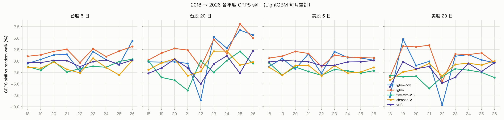

# Finpre — 每個訊號都附成績單的 AI 投資研究助理

台股＋美股。四位 AI 分析師協作：**技術分析師**、**基本面／籌碼／情緒分析師**、**量化 ML 工程師**（TimesFM 2.5 為 v1 基準；2018–2026 回測後由每月重訓的 LightGBM 擔任各市場 champion，Chronos-2 / TimesFM 3.0 持續當 challenger，另有台股選股排序模型），由 **首席分析師** 統籌結論並與使用者對話。

差異化：**可驗證**。每個預測都能追溯到 walk-forward 回測與上線後的真實追蹤；表現不好的年份、扣成本後不賺錢的策略也照實公開。

| 功能 | 說明 |
|---|---|
| 多代理個股分析 | 一次分析約 10–30 秒：技術、基本面／籌碼／情緒、量化預測 → 整合訊號、信心、未來報酬率區間 |
| 風險雷達 | 持股組合未來 5／20 日報酬區間、VaR／ES、集中度、相關性、個股尾端損失貢獻、匯率 |
| 每日盤後報告 | 市場狀態、研究清單排名、觀察清單風險區間、模型成績單；JSON／HTML／Markdown |
| 成績單 | 回測（2018–2026）＋上線後每日自動計分（區間覆蓋、方向命中、相對 random walk、排名實際 IC） |
| 合規模式 | 研究模式（預設）在輸出邊界強制移除買賣建議與價位；顧問模式僅限持牌機構；HMAC 雜湊鏈稽核紀錄 |
| B2B API | API 金鑰、方案限制、計量（失敗退款）、快取、稽核匯出 |

文件：[產品規劃](docs/PRODUCT.md) · [架構與 benchmark](docs/ARCHITECTURE.md) · [API](docs/API.md) · [維運手冊](docs/OPERATIONS.md) · [銷售一頁式簡介](docs/sales/one-pager.md) · [Demo 腳本](docs/sales/demo-script.md) · [產品首頁](docs/sales/landing-page.html)

## 快速開始（M2 Mac）

```bash
git clone git@github.com:tim3959951/Finpre.git && cd Finpre
uv venv --python python3.11 .venv && source .venv/bin/activate
uv pip install -e ".[models,llm,api,dev]"
cp .env.example .env        # 填入 ANTHROPIC_API_KEY / OPENAI_API_KEY / FINMIND_TOKEN（皆為選填）

pytest -q                                   # 116 個測試（離線、合成資料）
python scripts/compliance_check.py          # 合規自我測試（對抗式 LLM）
python scripts/analyze.py 2330 --provider none          # 規則模式，不需任何 LLM（研究模式）
python scripts/analyze.py NVDA --provider anthropic     # Anthropic API 當大腦
streamlit run fintech_agent/ui/app.py       # 網頁：研究助理 / 個股分析 / 風險雷達 / 每日報告 / 成績單 / 模型實驗室
uvicorn fintech_agent.api.main:app --port 8000          # API，文件在 /docs
python scripts/daily_job.py --market TW --force         # 每日排程的一次手動執行
```

## 部署（Docker）

```bash
docker compose up -d        # api :8000、web :8501（API 金鑰登入）、scheduler（台股 15:40、美股 06:30）
docker compose run --rm api python scripts/manage_tenants.py create --name "示範" --plan pro
```

詳見 [維運手冊](docs/OPERATIONS.md)（上線檢查清單、備份、監控、事件處理）。

## 合規模式

| | 研究模式 `research`（預設） | 顧問模式 `advisor` |
|---|---|---|
| 對象 | 所有非持牌客戶 | 企業版＋持牌證券投資顧問事業（兩者缺一不可） |
| 輸出 | 訊號、分數、信心、報酬率區間（%）、波動、模型成績 | 另含動作、部位、進場、停損、停利 |

研究模式的過濾在程式的輸出邊界執行（正規化全形／簡體／隱藏字元 → 建議用語 → 價位偵測），並由對抗式測試與每日報告掃描把關。設計說明見 [ARCHITECTURE §14](docs/ARCHITECTURE.md)。

## 模型 benchmark 與 A/B 測試

```bash
# Walk-forward 回測，只評估模型發布後的區間（避免預訓練資料洩漏）
python scripts/benchmark.py --market TW --horizon 5 --windows 60 --min-origin 2025-10-01
python scripts/benchmark.py --market US --horizon 20 --windows 40 --step 20
# 挑戰者顯著勝出時自動升級 champion
python scripts/benchmark.py --market TW --horizon 5 --promote
# 50 檔 + 籌碼/大盤/匯率共變數（台股需 FinMind，建議設定 FINMIND_TOKEN 提高額度）
python scripts/benchmark.py --universe tw50 --horizon 5 --windows 60 --min-origin 2025-10-01 \
  --models naive timesfm-2.5 timesfm-2.5-xreg chronos-2 chronos-2-cov lgbm lgbm-cov ensemble ensemble-cov
# 各市場整合結果成 markdown 表格
python scripts/summarize_benchmarks.py TW:5:logs/b50_tw50_h5.csv US:5:logs/b50_us50_h5.csv
# 2018 → 今天、LightGBM 每月重訓（LightGBM 單獨一個程序才能開多執行緒）
FA_LGBM_JOBS=4 OMP_NUM_THREADS=4 python scripts/benchmark.py --universe tw50 --horizon 5 \
  --models naive drift lgbm lgbm-cov --years 13 --min-origin 2018-01-01 --windows 100000 --retrain M --out logs/lh_tw50_h5_ml.csv

# 選股排序：逐日選出上市流動性前 50，回測 + 產生今日排名（量化 Agent 會讀取）
python scripts/rank_stocks.py --pool twse --pit-top 50 --horizon 5 --backtest --start 2018-01-01 --out logs/rank_twpit_h5
python scripts/rank_stocks.py --pool twse --pit-top 50 --horizon 5          # 每日盤後更新排名

# 所有 benchmark 圖表 → docs/benchmarks/v0.3/（PNG + chart_data.json）
python scripts/export_benchmark_charts.py && python scripts/plot_benchmarks.py

# 訓練本地模型（量化 Agent 會自動載入 checkpoints/；LightGBM 每個約 5–15 秒）
python scripts/train_models.py --universe tw50 --models lgbm --horizons 5 20 --years 13
python scripts/train_models.py --universe us50 --models lgbm --horizons 5 20 --years 13
python scripts/train_models.py --universe us50 --models dlinear --horizons 20 --epochs 20   # M2 GPU (MPS)
```

Champion 查找順序：本機升級紀錄 `runs/champion.json` → `settings.yaml` 的 `forecasting.champions`（v0.3：四組都是 `lgbm`）→ 預設 `forecasting.champion`（TimesFM 2.5）。若 champion 是 LightGBM 但本機尚未訓練 checkpoint，量化 Agent 會自動退回 TimesFM 2.5 並在 log 提示執行 `train_models.py`。

### v0.3 結果摘要（2018-01 → 2026-09，CRPS 相對 random walk，LightGBM 每月重訓）

| | 台股 5 日 | 台股 20 日 | 美股 5 日 | 美股 20 日 |
|---|---|---|---|---|
| **LightGBM** | **+1.8%**（49/50 檔勝出） | **+3.0%**（44/50） | **+0.8%**（48/50） | **+0.6%**（37/50） |
| LightGBM＋籌碼／大盤／匯率 | +0.7% | +1.4% | −0.2% | −1.6% |
| TimesFM 2.5 | −1.0% | −1.6% | −2.1% | −3.3% |
| Chronos-2 | −1.3% | −0.5% | −1.9% | −1.7% |

- 台股選股排序（每天依成交值選出上市前 50）：LightGBM＋籌碼每週 IC 0.03（t ≈ 3.4–3.9），前 10 名未扣成本每年多約 7–9%，扣 58.5 bps 牌價成本後**沒有勝過**等權持有（−0.5% ～ −2.8%）；降低週轉的平滑版本也沒有（ARCHITECTURE §14.6）。產品因此把排名定位成研究篩選，並在報告直接揭露。
- 用「現行台灣 50」回測會嚴重高估動能策略（存活者偏差）；逐日選股後動能 IC 為負。
- 圖表：`docs/benchmarks/v0.3/*.png`；完整解讀見 `docs/ARCHITECTURE.md` §11。



| 模型 | 類型 | 授權 | 備註 |
|---|---|---|---|
| `timesfm-2.5` | 基礎模型 | Apache-2.0 | v1 champion / 預設退回模型，200M，16k context，分位數輸出；80% 區間覆蓋最準 |
| `timesfm-3.0` | 基礎模型 | **非商用** | 僅供研究比較；`allow_noncommercial_models: true` 才會在 UI 出現 |
| `chronos-2` / `chronos-bolt-small` / `chronos-bolt-base` | 基礎模型 | Apache-2.0 | Amazon |
| `tirex` | 基礎模型 | NXAI 社群授權 | 選配：`pip install tirex-ts` |
| `naive` / `drift` / `arima` | 統計基準 | – | naive（random walk）是必須打敗的基準 |
| `dlinear` / `lgbm` | 本地訓練 | – | DLinear 在 MPS 上訓練；LightGBM 分位數迴歸（**v0.3 champion：四組市場／天期**）|
| `ensemble` | 集成 | – | 成員見 `forecasting.ensemble_members` |
| `chronos-2-cov` / `timesfm-2.5-xreg` / `lgbm-cov` / `ensemble-cov` | 共變數版 | 同原模型 | 加入三大法人、融資、大盤、費半、匯率（美股：S&P 500、VIX、利率、美元）；長期回測中不如不含共變數的版本 |
| `timesfm-3.0-cov` | 共變數版 | **非商用** | 僅研究比較 |

## 專案結構

```
fintech_agent/
  product/       合規模式、稽核紀錄、方案與計量、風險雷達、每日報告、成績單、預測服務
  api/           FastAPI B2B API
  data/          yfinance + FinMind 資料、快取、籌碼/營收/估值摘要
  features/      技術指標、技術/基本面/籌碼/情緒規則評分
  forecasting/   統一 Forecaster 介面、TimesFM/Chronos/TiRex、基準、DLinear/LGBM、registry
  evaluation/    walk-forward 回測、指標、Diebold-Mariano A/B、實驗紀錄與 champion registry、shadow 線上 A/B
  llm/           可插拔 LLM（Anthropic / OpenAI 相容 / Ollama / 規則模式）+ tool-calling loop
  agents/        三位專家 + 首席分析師／顧問（調度、決策、對話；依合規模式輸出）
  ranking/       選股排序：橫斷面特徵、LightGBM 排序器、因子基準、排序回測
  ui/            Streamlit 介面
scripts/         daily_job / scheduler / manage_tenants / compliance_check / ui_smoke_test /
                 analyze / benchmark / rank_stocks / train_models / summarize_benchmarks / export_benchmark_charts / plot_benchmarks
config/settings.yaml
```

> 本系統輸出僅供研究與教育用途，不構成投資建議。若要對外提供個股買賣建議服務，在台灣需具證券投資顧問事業許可；研究模式的呈現方式上線前應請熟悉證券法規的律師確認。
