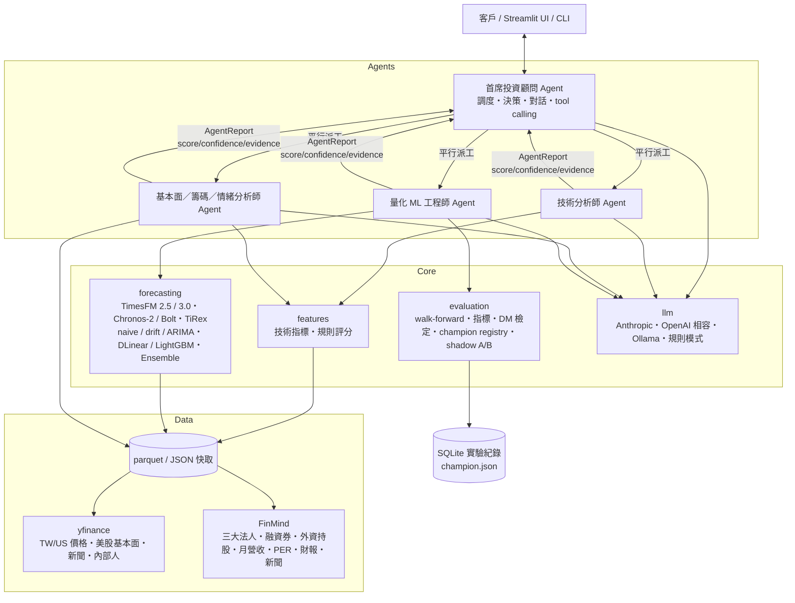

# Fintech Agent 架構設計文件 v0.1

> 以 Google TimesFM 為核心預測引擎的多代理（multi-agent）AI 投資分析系統。第一階段市場：台灣、美國。
> 最後更新：2026-09-25

---

## 1. 產品目標與設計原則

| 目標 | 設計決策 |
|---|---|
| 高準確率預測 | 不押單一模型：TimesFM 2.5 為 champion，Chronos-2 / Chronos-Bolt / 統計基準 / 本地訓練模型為 challenger，以 walk-forward 回測 + 統計檢定持續 A/B，勝者才升級 |
| 可信、可稽核 | 每個 Agent 都是「**規則引擎先算分（確定性、可重現）→ LLM 解讀並在 ±0.5 內微調**」。LLM 不能捏造數字，也不能無限制推翻量化證據 |
| 誠實面對市場本質 | 短期股價接近 random walk。量化 Agent 會用「此標的的回測技能」折減自己的訊號；模型打不贏 naive 時，首席顧問自動降低其權重 |
| 可插拔 | LLM（Anthropic / OpenAI 相容 / Ollama / 無 LLM）、預測模型、資料源皆透過介面抽換 |
| 在 M2 本地可跑 | 基礎模型推論用 CPU（小 batch 比 MPS 快），本地訓練（DLinear）用 MPS GPU；16 GB RAM 足夠 |

## 2. 系統架構

### 一次完整分析的流程

1. 首席顧問解析需求（對話模式由 LLM tool call 觸發 `analyze_stock`），建立 `AnalysisContext`（價格、公司資料、大盤只抓一次，三位專家共用）。
2. 三位專家以 `ThreadPoolExecutor` **平行**執行，各自輸出 `AgentReport`：`score ∈ [-2, +2]`、`confidence ∈ [0, 1]`、摘要、重點、風險、完整證據 JSON。
3. **決策引擎草案**（確定性）：信心加權平均分數 → 動作；ATR 停損、壓力位 / TimesFM P90 停利；部位 = 風險屬性上限 × 分數強度 × 信心 × 波動度縮放。
4. **首席顧問 LLM** 看草案與三份報告做最終決策（JSON），有護欄：動作必須在白名單、部位不得超過風險屬性上限、偏離草案 ≥2 級會標示 `advisor_override`。
5. 量化模型的所有預測寫入 shadow log，到期後可做線上 A/B。

## 3. 四個 Agent

### 3.1 技術分析師（`TechnicalAgent`）
- **指標**：MA 5/10/20/60/120/240（週/雙週/月/季/半年/年線）、乖離率、MACD（DIF/DEA/OSC）、KD（台股 9,3,3 算法）、RSI 6/14、布林 %b 與帶寬壓縮、ADX/±DI、ATR、OBV、Williams %R、量比、52 週高低、支撐壓力。
- **規則**：均線排列、站上/跌破季線與年線、MACD 交叉與柱狀體方向、KD 高低檔交叉與鈍化、RSI 超買超賣、布林突破是否帶量、爆量長紅/長黑、乖離過熱；**ADX > 25 放大趨勢訊號、< 20 降權**。
- 信心 = 多空訊號一致度 + 趨勢強度。

### 3.2 基本面／籌碼／情緒分析師（`FundamentalAgent`）
| 面向 | 台股 | 美股 |
|---|---|---|
| 基本面 | 月營收 YoY/MoM/近 3 月平均/24 月新高、EPS TTM 成長、毛利率變化、**本益比近 3 年百分位**（河流圖概念）、殖利率 | 營收/獲利成長、forward vs trailing P/E、PEG、分析師評等 |
| 籌碼 | 外資/投信/自營商買賣超與**連買連賣天數**、法人淨額占均量、融資增減 vs 股價（籌碼凌亂/沉澱）、券資比、外資持股比例變化 | 機構持股、short interest 及月變化、內部人買賣 |
| 情緒 | 新聞標題 LLM 逐則評分（無 LLM 時中英詞典法） | 同左 |
| 行情 | 加權指數季線/月線、外資對台股整體買賣超 | S&P 500 趨勢、VIX |

四個子分數分別呈現（`sub_scores`），讓顧問看得出分歧來源。

### 3.3 量化 ML 工程師（`QuantAgent`）
- 讀取 champion registry（`runs/champion.json`，預設 TimesFM 2.5），執行 **模型面板**：champion + Chronos-2 + Chronos-Bolt small + naive。
- 輸出：預測報酬、**上漲機率**（由分位數曲線內插 CDF）、P10/P90 區間、模型方向一致度。
- **即時技能檢查**：在該標的上跑 30 個非重疊 walk-forward 視窗（每日快取），得到 MASE、相對 naive 技能、方向準確率與二項檢定 p 值、區間覆蓋率。
- 分數 = `clip((P(up) − 0.5) × 8)` × **技能折減係數**（打不贏 naive 的模型，訊號會被壓到 0.15–0.3 倍）。
- 若其他模型在此標的 MASE 明顯較低，建議排入 A/B 測試。

### 3.4 首席投資顧問（`InvestmentAdvisor`）
- **調度**：完整分析時平行派工；對話模式下透過 tool calling 自主決定呼叫 `analyze_stock / technical_analysis / fundamental_analysis / quant_forecast / compare_models / get_quote / available_models`。
- **決策**：權重預設 技術 0.30 / 基本面 0.30 / 量化 0.40，量化權重再乘上技能係數；專家分數離散度越大，整體信心越低。
- **客戶化**：風險屬性決定單一部位上限（保守 5% / 穩健 10% / 積極 20%）與停損倍數（1.5 / 2.0 / 2.5 × ATR）；有持股時用「持有/減碼/賣出」，無持股時用「觀望/避開」。
- 無 LLM 時仍可給出完整決策（規則模式）。

## 4. 預測層

統一介面：`Forecaster.predict(contexts: list[np.ndarray], horizon) -> list[ForecastResult]`，`ForecastResult` 含點預測與 0.1–0.9 九個分位數。可訓練模型另有 `fit(series)`。

| 模型 | 參數量 | 授權 | M2 實測 | 用途 |
|---|---|---|---|---|
| TimesFM 2.5 | 200M | Apache-2.0 | CPU 推論 | **v1 champion** |
| TimesFM 3.0 | ~400M | **TimesFM 非商用授權** | CPU | 僅研究比較，預設隱藏 |
| Chronos-2 | 120M | Apache-2.0 | CPU | 主要 challenger，支援共變數 |
| Chronos-Bolt small/base | 48M/205M | Apache-2.0 | CPU | 快速 challenger |
| TiRex | 35M | NXAI 社群授權 | 選配 | challenger |
| naive / drift / AutoARIMA | – | – | CPU | 基準 |
| DLinear（全域、分位數） | ~0.1M | 自有 | **MPS GPU 訓練** | 本地訓練 |
| LightGBM 分位數迴歸 | – | 自有 | CPU | 本地訓練、可加籌碼特徵 |
| Ensemble | – | 依成員 | – | 點預測取中位數、分位數平均 |

**實作注意（已處理）**
- `timesfm` 套件的 `forecast()` 會**原地修改 inputs list**（補齊到 batch size），且只自動選 CUDA/CPU；wrapper 會傳入副本並可手動導到 MPS。
- TimesFM 2.5 的 quantile 輸出第 0 欄是 mean，1–9 欄才是 P10–P90。
- M2 上小 batch 推論 CPU 比 MPS 快（MPS 首次載入 15–30 s），因此 `inference_device: cpu`、`training_device: auto(mps)`。

## 5. 評估與 A/B 測試

### 5.1 Walk-forward 回測（`evaluation/backtest.py`）
- 由最近往回切 `n_windows` 個預測起點、間隔 `step`；每個預測只看得到起點之前的資料（單元測試驗證無洩漏）。
- 可訓練模型只用「最早起點之前」的資料訓練一次。
- `--min-origin 2025-10-01`：只評估模型發布後的區間，避免基礎模型的預訓練語料已看過測試期。

### 5.2 指標（`evaluation/metrics.py`）
- 點預測：MAE、RMSE、MAPE、sMAPE、**MASE**、**skill vs naive = 1 − MAE/MAE_naive**。
- 機率預測：WQL（weighted quantile loss）、CRPS、**80% 區間覆蓋率**、區間寬度。
- 方向與交易：方向準確率（+二項檢定）、IC（預測報酬與實際報酬的 Spearman 相關）、
  非重疊視窗策略回測（含成本：台股來回 58.5 bps、美股 5 bps）的 Sharpe、最大回撤 vs 同期 buy & hold。

### 5.3 Champion / Challenger A/B（`evaluation/abtest.py`）
- **離線**：同一組 (ticker, 起點) 配對，對每檔做 Diebold-Mariano（HLN 小樣本修正、Newey-West h−1 lag），以 Stouffer 法合併；另做 moving-block bootstrap 信賴區間與各檔勝率。
- **升級規則**：挑戰者合併 p < 0.05 **且** 至少 55% 標的勝出 → `promote`；`benchmark.py --promote` 或 UI 按鈕寫入 `runs/champion.json`（依市場 × 預測天數分開管理）。
- **線上（shadow mode）**：每次分析都把所有面板模型的預測寫入 SQLite，到期後 `resolve()` 補上實際值，UI「線上 shadow A/B」查看真實世界表現。

## 6. 資料層
- **yfinance**：台股（`.TW` / `.TWO` 自動判斷）與美股還原權值日 K、美股基本面、新聞、內部人交易。
- **FinMind REST**：`TaiwanStockInstitutionalInvestorsBuySell`、`TaiwanStockMarginPurchaseShortSale`、`TaiwanStockShareholding`、`TaiwanStockMonthRevenue`、`TaiwanStockPER`、`TaiwanStockFinancialStatements`、`TaiwanStockNews`、`TaiwanStockTotalInstitutionalInvestors`、`TaiwanStockInfo`。無 token 可用，設定 `FINMIND_TOKEN` 提高額度。
- 所有外部呼叫失敗時回傳空值、不中斷分析；parquet/JSON 磁碟快取（預設 12 小時）。

## 7. LLM 層
- 中立訊息格式 `Message / ToolCall / Tool`，轉接器：`AnthropicClient`（未指定模型時自動從 Models API 選最新的中階模型）、`OpenAICompatClient`（OpenAI、vLLM、LM Studio、OpenRouter）、`OllamaClient`（本地原生 `/api/chat`，預設 `qwen3:8b`、`think=false` 關閉思考模式以加速並保持 JSON 輸出乾淨，未安裝時自動改用已下載的模型）、`NullLLM`（規則模式）。
- 可在 `settings.yaml` 的 `llm.per_agent` 為每個 Agent 指定不同供應商（例：專家用本地 Ollama 省成本、顧問用雲端大模型）。
- `run_tool_loop`：工具錯誤會回傳給模型而不是讓對話崩潰；最多 6 輪。

## 8. 關於「高準確率」— 我們承諾什麼、不承諾什麼

1. **價格水準的 MAPE 很低不代表有預測力**：random walk 5 日 MAPE 本來就只有 2–4%。真正的判準是 **MASE / skill vs naive < 0**、**方向準確率顯著 > 50%**、**IC > 0**、**扣成本後策略 Sharpe > buy & hold**。
2. 基礎模型在個股短期價格上多半只和 random walk 打平；它們的強項是**波動區間（分位數）**：區間覆蓋率接近 80% 就能直接用於停損、部位大小、風險預算。
3. 可實際提升準確度的方向（見 roadmap）：預測對象改成報酬/波動而非價格、加入籌碼與大盤共變數（Chronos-2、TimesFM XReg、TimesFM 3.0 multivariate）、LoRA 微調、橫斷面排序（選股）而非單檔時序。

## 9. 合規提醒（商品化前必讀）
- 在台灣對不特定人提供個股買賣建議，屬《證券投資信託及顧問法》規範之投資顧問業務，需**證券投資顧問事業許可**；訂閱制「AI 投顧」同樣適用。美國則涉及 Investment Advisers Act / SEC 註冊。
- TimesFM 3.0 權重為**非商用授權**，正式商品只能用 2.5（Apache-2.0）或其他可商用模型；TiRex 需確認 NXAI 授權條款。
- yfinance 為非官方 Yahoo 介面，商用須改用授權資料源（TEJ、XQ、CMoney、FinMind 付費方案、Polygon、Nasdaq Data Link 等）。
- 所有輸出已附免責聲明；對話紀錄與建議應保存以供稽核。

## 10. Roadmap

| 階段 | 內容 |
|---|---|
| **v0.1（本版）** | 四 Agent、TimesFM 2.5 champion、7+ benchmark 模型、walk-forward、DM A/B、shadow log、Streamlit、可插拔 LLM、M2 本地訓練 DLinear |
| v0.2 | 共變數預測（法人買賣超、融資、大盤、匯率 → Chronos-2 / TimesFM XReg）；報酬與波動率目標；TimesFM 3.0 研究對照；FinBERT/自訓中文金融情緒模型 |
| v0.3 | TimesFM 2.5 LoRA 微調（HF Transformers + PEFT，MPS），以台股全市場資料；橫斷面選股排名 + 投組最佳化 |
| v0.4 | 排程每日盤後自動分析與 shadow 結算、LINE Bot/網頁推播、使用者帳號與持倉、FastAPI 後端 |
| v1.0 | 授權資料源、合規流程（KYC 風險屬性問卷、紀錄保存）、雲端部署 |

## 11. 首輪 Benchmark 結果（2026-09-26，M2 Pro 16 GB 實跑）

**設定**：只評估模型發布後的區間（預測起點 ≥ 2025-10-01，避免預訓練資料洩漏）；台股 2330 / 2317 / 2454 / 2881 / 2412 / 0050，美股 AAPL / MSFT / NVDA / JPM / XOM / SPY；5 日預測每 5 日一個視窗（每市場約 290 個視窗）、20 日預測每 20 日一個視窗（約 71 個）。可訓練模型只用 2025-10 之前資料訓練。
**排序指標**：CRPS（以價格百分比表示，跨標的可比）；`crps_skill` = 相對 random walk 的改善幅度，正值才代表有預測力。

### 5 日預測 — CRPS skill vs random walk（越高越好）

| 模型 | 台股 | 美股 | 台股 80% 區間覆蓋 | 美股 80% 區間覆蓋 | 台股方向準確率 | 美股方向準確率 |
|---|---|---|---|---|---|---|
| drift | +0.7% | +0.0% | 72% | 78% | 55% | 57% |
| lgbm | +0.4% | −0.3% | 73% | 77% | 54% | 53% |
| **naive (random walk)** | 0 | 0 | 72% | 78% | – | – |
| ensemble (TimesFM 2.5 + Chronos-2 + Bolt) | −0.2% | −0.3% | 79% | 81% | 46% | 50% |
| timesfm-3.0（非商用，僅研究） | −0.8% | **+0.4%** | 74% | 78% | 48% | 52% |
| **timesfm-2.5（champion）** | −1.0% | −2.4% | **81%** | 82% | 46% | 49% |
| chronos-2 | −3.5% | −1.1% | 74% | 77% | 41% | 50% |
| chronos-bolt-small | −3.9% | −2.9% | 78% | 79% | 52% | 54% |
| dlinear（校準後） | −12.4% | −14.0% | 86% | 79% | 53% | 46% |

### 20 日預測 — CRPS skill vs random walk

| 模型 | 台股 | 美股 |
|---|---|---|
| drift | **+2.9%** | +0.4% |
| ensemble | +1.7% | −0.7% |
| timesfm-3.0 | +1.1% | −2.1% |
| lgbm | +0.2% | **+2.5%** |
| chronos-2 | −7.4% | +1.3% |
| timesfm-2.5 | −1.2% | −2.4% |

### 解讀（誠實版）
1. **沒有任何模型在統計上穩定打敗 random walk**：基礎模型與統計模型的 CRPS 大多落在 random walk ±4% 以內，方向準確率 41–63%、IC ≈ 0。扣除交易成本後，多數「預測上漲才持有」策略的 Sharpe 低於同期 buy & hold；少數例外（LightGBM：台股 5 日 0.89 vs 0.69、美股 20 日 1.07 vs 1.06）樣本太小、未達顯著，值得在更大的股票池上驗證。整體與學術文獻一致：只看日頻價格序列的 zero-shot 基礎模型沒有可靠的方向 alpha。
2. **TimesFM 2.5 的價值在「區間」而非「方向」**：台股 80% 區間實際覆蓋 81%（最接近理想值），很適合拿來算停損、部位大小與風險預算——這正是目前決策引擎的用法。
3. A/B 檢定（CRPS、DM + Stouffer，α=0.05）：美股 5 日 **TimesFM 3.0 顯著優於 2.5**（p=0.006，6/6 檔勝出），ensemble 也顯著優於 2.5（p=0.007）；但兩者都只比 random walk 好 0–0.4%，且 3.0 為非商用授權 → **維持 TimesFM 2.5 為 champion**，量化 Agent 的技能折減係數會自動把它的方向訊號壓低。
4. 本地訓練的 DLinear 原本區間嚴重過窄（覆蓋僅 45–52%）；加入以驗證集 pinball loss 最小化的事後校準後，覆蓋率回到 79–86%，但 CRPS 仍明顯輸給 random walk → 單純價格序列的小模型不值得當 challenger，資源應轉向 v0.2 的共變數。
5. 樣本限制：每市場 6 檔、約 12 個月，統計檢定力有限；正式結論需擴大到全市場（台股 50/100 檔、S&P 100）與多個市場狀態。

**下一步最值得做的三件事**：(a) 加入籌碼/大盤/匯率共變數（Chronos-2、TimesFM XReg）；(b) 預測目標改為報酬率與波動率，並做橫斷面排序選股；(c) 擴大回測股票池，每週排程自動跑 benchmark 與 shadow 結算。

原始報告：`runs/benchmark_*.json`；逐視窗結果：`logs/bench_*_h*.csv`。
