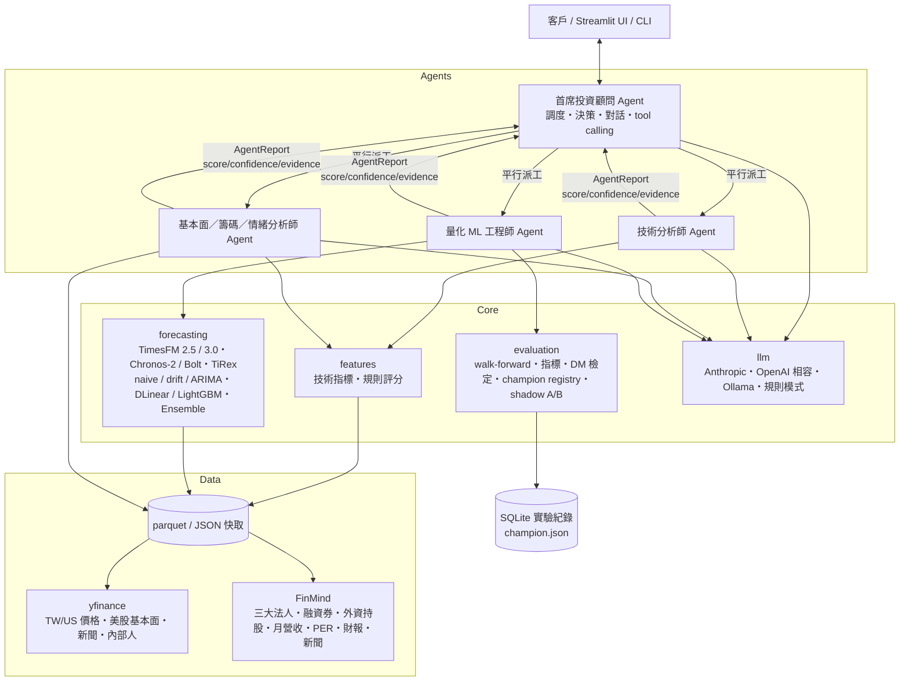
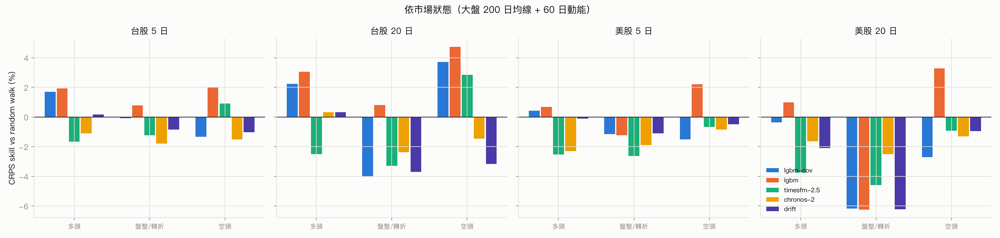
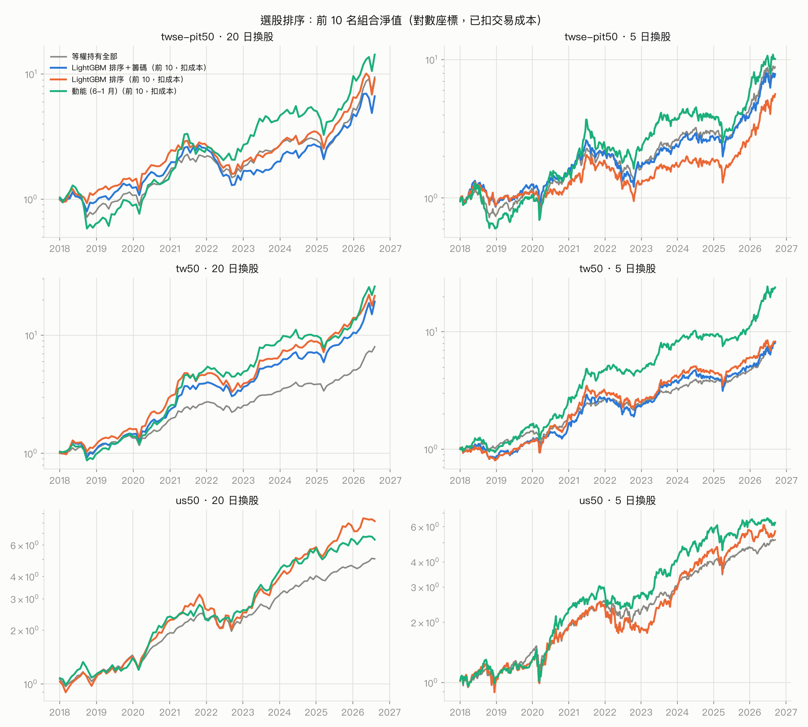
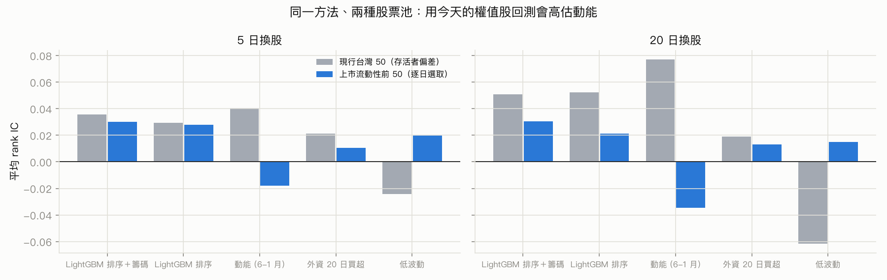
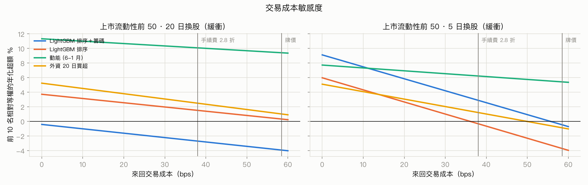
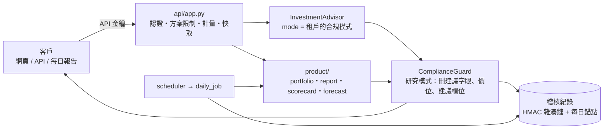

# Finpre（Fintech Agent）架構設計文件 v1.0

> 以 Google TimesFM 為起點的多代理（multi-agent）AI 投資研究系統。第一階段市場：台灣、美國。
> 最後更新：2026-10-01。v1.0 新增的產品層（合規模式、稽核、API、方案計量、每日報告、風險雷達、成績單）見 §14；
> 產品規劃見 `docs/PRODUCT.md`，維運見 `docs/OPERATIONS.md`，API 見 `docs/API.md`。

---

## 1. 產品目標與設計原則

| 目標 | 設計決策 |
|---|---|
| 高準確率預測 | 不押單一模型：TimesFM 2.5 為 v1 champion 與預設退回模型，Chronos-2 / Chronos-Bolt / 統計基準 / 本地訓練模型為 challenger，以 walk-forward 回測 + 統計檢定持續 A/B，勝者才升級（v0.3：2018–2026 回測後，四組市場／天期都由每月重訓的 LightGBM 擔任 champion，見 §11） |
| 可信、可稽核 | 每個 Agent 都是「**規則引擎先算分（確定性、可重現）→ LLM 解讀並在 ±0.5 內微調**」。LLM 不能捏造數字，也不能無限制推翻量化證據 |
| 誠實面對市場本質 | 短期股價接近 random walk。量化 Agent 會用「此標的的回測技能」折減自己的訊號；模型打不贏 naive 時，首席顧問自動降低其權重 |
| 可插拔 | LLM（Anthropic / OpenAI 相容 / Ollama / 無 LLM）、預測模型、資料源皆透過介面抽換 |
| 在 M2 本地可跑 | 基礎模型推論用 CPU（小 batch 比 MPS 快），本地訓練（DLinear）用 MPS GPU；16 GB RAM 足夠 |

## 2. 系統架構


```mermaid
flowchart TB
    U[客戶 / Streamlit UI / CLI] <--> ADV
    subgraph Agents
      ADV[首席投資顧問 Agent<br/>調度・決策・對話・tool calling]
      TA[技術分析師 Agent]
      FA[基本面／籌碼／情緒分析師 Agent]
      QA[量化 ML 工程師 Agent]
    end
    ADV -- 平行派工 --> TA & FA & QA
    TA & FA & QA -- AgentReport<br/>score/confidence/evidence --> ADV
    subgraph Core
      FEAT[features<br/>技術指標・規則評分]
      FC[forecasting<br/>TimesFM 2.5 / 3.0・Chronos-2 / Bolt・TiRex<br/>naive / drift / ARIMA・DLinear / LightGBM・Ensemble]
      EVAL[evaluation<br/>walk-forward・指標・DM 檢定・champion registry・shadow A/B]
      LLM[llm<br/>Anthropic・OpenAI 相容・Ollama・規則模式]
    end
    TA --> FEAT
    FA --> FEAT
    QA --> FC & EVAL
    ADV & TA & FA & QA --> LLM
    subgraph Data
      YF[yfinance<br/>TW/US 價格・美股基本面・新聞・內部人]
      FM[FinMind<br/>三大法人・融資券・外資持股・月營收・PER・財報・新聞]
      CACHE[(parquet / JSON 快取)]
    end
    FEAT & FC & FA --> CACHE --> YF & FM
    EVAL --> DB[(SQLite 實驗紀錄<br/>champion.json)]
```

### 一次完整分析的流程

1. 首席顧問解析需求（對話模式由 LLM tool call 觸發 `analyze_stock`），建立 `AnalysisContext`（價格、公司資料、大盤只抓一次，三位專家共用）。
2. 三位專家以 `ThreadPoolExecutor` **平行**執行，各自輸出 `AgentReport`：`score ∈ [-2, +2]`、`confidence ∈ [0, 1]`、摘要、重點、風險、完整證據 JSON。
3. **決策引擎草案**（確定性）：信心加權平均分數 → 動作；ATR 停損、壓力位 / TimesFM P90 停利；部位 = 風險屬性上限 × 分數強度 × 信心 × 波動度縮放。
4. **首席顧問 LLM** 看草案與三份報告做最終決策（JSON），有護欄：動作必須在白名單、部位不得超過風險屬性上限、偏離草案 ≥2 級會標示 `advisor_override`。
5. 量化模型的所有預測寫入 shadow log，到期後可做線上 A/B。

## 3. 四個 Agent

### 3.1 技術分析師（`TechnicalAgent`）
- **指標**：MA 5/10/20/60/120/240（週/雙週/月/季/半年/年線）、乖離率、MACD（DIF/DEA/OSC）、KD（台股 9,3,3 算法）、RSI 6/14、布林 %b 與帶寬壓縮、ADX/±DI、ATR、OBV、Williams %R、量比、52 週高低、支撐壓力。
- **規則**：均線排列、站上/跌破季線與年線、MACD 交叉與柱狀體方向、KD 高低檔交叉與鈍化、RSI 超買超賣、布林突破是否帶量、爆量長紅/長黑、乖離過熱；**ADX > 25 放大趨勢訊號、< 20 降權**。
- 信心 = 多空訊號一致度 + 趨勢強度。

### 3.2 基本面／籌碼／情緒分析師（`FundamentalAgent`）
| 面向 | 台股 | 美股 |
|---|---|---|
| 基本面 | 月營收 YoY/MoM/近 3 月平均/24 月新高、EPS TTM 成長、毛利率變化、**本益比近 3 年百分位**（河流圖概念）、殖利率 | 營收/獲利成長、forward vs trailing P/E、PEG、分析師評等 |
| 籌碼 | 外資/投信/自營商買賣超與**連買連賣天數**、法人淨額占均量、融資增減 vs 股價（籌碼凌亂/沉澱）、券資比、外資持股比例變化 | 機構持股、short interest 及月變化、內部人買賣 |
| 情緒 | 新聞標題 LLM 逐則評分（無 LLM 時中英詞典法） | 同左 |
| 行情 | 加權指數季線/月線、外資對台股整體買賣超 | S&P 500 趨勢、VIX |

四個子分數分別呈現（`sub_scores`），讓顧問看得出分歧來源。

### 3.3 量化 ML 工程師（`QuantAgent`）
- 讀取 champion registry（`runs/champion.json` → `forecasting.champions` → 預設 TimesFM 2.5），執行 **模型面板**：champion + Chronos-2 + Chronos-2（共變數）+ Chronos-Bolt small + naive；本地訓練的 champion 從 `checkpoints/` 載入，若尚未訓練則自動退回 TimesFM 2.5。
- 輸出：預測報酬、**上漲機率**（由分位數曲線內插 CDF）、P10/P90 區間、模型方向一致度。
- **即時技能檢查**：在該標的上跑 30 個非重疊 walk-forward 視窗（每日快取），得到 MASE、相對 naive 技能、方向準確率與二項檢定 p 值、區間覆蓋率。
- 分數 = `clip((P(up) − 0.5) × 8)` × **技能折減係數**（打不贏 naive 的模型，訊號會被壓到 0.15–0.3 倍）。
- 若其他模型在此標的 MASE 明顯較低，建議排入 A/B 測試。
- **選股排序訊號**（v0.3）：讀取 `scripts/rank_stocks.py` 產生的當日排名，加入「第 k/50 名」訊號；權重上限 ±0.3，依排序模型回測 IC 的 t 值折減，快照超過 7 天則忽略。

### 3.4 首席投資顧問（`InvestmentAdvisor`）
- **調度**：完整分析時平行派工；對話模式下透過 tool calling 自主決定呼叫 `analyze_stock / technical_analysis / fundamental_analysis / quant_forecast / compare_models / get_quote / available_models`。
- **決策**：權重預設 技術 0.30 / 基本面 0.30 / 量化 0.40，量化權重再乘上技能係數；專家分數離散度越大，整體信心越低。
- **客戶化**：風險屬性決定單一部位上限（保守 5% / 穩健 10% / 積極 20%）與停損倍數（1.5 / 2.0 / 2.5 × ATR）；有持股時用「持有/減碼/賣出」，無持股時用「觀望/避開」。
- 無 LLM 時仍可給出完整決策（規則模式）。

## 4. 預測層

統一介面：`Forecaster.predict(contexts: list[np.ndarray], horizon) -> list[ForecastResult]`，`ForecastResult` 含點預測與 0.1–0.9 九個分位數。可訓練模型另有 `fit(series)`。

| 模型 | 參數量 | 授權 | M2 實測 | 用途 |
|---|---|---|---|---|
| TimesFM 2.5 | 200M | Apache-2.0 | CPU 推論 | v1 champion、預設退回模型、區間最準 |
| TimesFM 3.0 | ~400M | **TimesFM 非商用授權** | CPU | 僅研究比較，預設隱藏 |
| Chronos-2 | 120M | Apache-2.0 | CPU | 主要 challenger，支援共變數 |
| Chronos-Bolt small/base | 48M/205M | Apache-2.0 | CPU | 快速 challenger |
| TiRex | 35M | NXAI 社群授權 | 選配 | challenger |
| naive / drift / AutoARIMA | – | – | CPU | 基準 |
| DLinear（全域、分位數） | ~0.1M | 自有 | **MPS GPU 訓練** | 本地訓練 |
| LightGBM 分位數迴歸 | – | 自有 | CPU，每個模型 5–15 s | **champion（四組）**；共變數版在長期回測中較差 |
| Ensemble | – | 依成員 | – | 點預測取中位數、分位數平均 |

**實作注意（已處理）**
- `timesfm` 套件的 `forecast()` 會**原地修改 inputs list**（補齊到 batch size），且只自動選 CUDA/CPU；wrapper 會傳入副本並可手動導到 MPS。
- TimesFM 2.5 的 quantile 輸出第 0 欄是 mean，1–9 欄才是 P10–P90。
- M2 上小 batch 推論 CPU 比 MPS 快（MPS 首次載入 15–30 s），因此 `inference_device: cpu`、`training_device: auto(mps)`。
- macOS 上 torch、LightGBM（Homebrew）與 scikit-learn 各自載入一份 libomp；Agent 在多執行緒中同時用到它們時會互鎖（deadlock）。套件匯入時預設 `OMP_NUM_THREADS=1` 避開（矩陣運算仍走 Accelerate，實測單檔分析 14 秒）；可用環境變數覆寫。

### 4.1 共變數（籌碼／大盤／匯率）— v0.2

> v0.3 註：2018–2026 長期回測中，共變數讓逐檔時序預測的 LightGBM 變差（§11.2）；籌碼資料目前主要用在選股排序（§11.3）。

`data/covariates.py` 為每檔股票建立與日 K 對齊的共變數面板，**全部是「當日收盤時已知」的 past-only 資料**：

| 欄位 | 台股 | 美股 | 防洩漏處理 |
|---|---|---|---|
| `vol_z` | 成交量 60 日 z-score | 同左 | – |
| `mkt_lvl` | log 加權指數 | log S&P 500 | 同日收盤 |
| `us_lvl` / `sox_lvl` | log S&P 500、log 費城半導體 | – | **只用台股日期「前一天以前」的美股收盤**（美股當天盤在台股收盤之後） |
| `fx_lvl` | log USD/TWD | – | 只用前一天以前的報價 |
| `vix_lvl` / `rate_lvl` / `dxy_lvl` | – | log VIX、10 年期殖利率、log 美元指數 | 同日 / 前一天 |
| `foreign/trust/dealer_flow_lvl` | 三大法人累積淨買超（以 60 日均量為單位） | – | FinMind 盤後公布，當日收盤後已知 |
| `margin_z` | 融資餘額相對 60 日均值 | – | 同上 |

四種用法（都在 walk-forward 中與「不加共變數」的同款模型做配對 A/B）：
- **`chronos-2-cov`**：Chronos-2 原生 past covariates（group attention，把共變數當成額外變量做 in-context learning）。
- **`timesfm-2.5-xreg`**：TimesFM 2.5 + XReg（in-context ridge）。XReg 需要預測期間的共變數值，所以所有欄位**落後 h 天**使用——測的是「籌碼／大盤是否領先個股 h 天」。需要 `jax`（pyproject 已列）。
- **`lgbm-cov`**：LightGBM 分位數迴歸，加入共變數的 1/5/20 日變化量特徵。
- **`timesfm-3.0-cov`**：TimesFM 3.0 原生 past-only covariates（非商用，僅研究）。
- `ensemble-cov` = TimesFM 2.5 + Chronos-2-cov + LGBM-cov。

回測時共變數只給到預測起點前一天（單元測試 `test_backtest_passes_only_past_covariates` 驗證）；量化 Agent 的即時面板也會自動帶入 `chronos-2-cov`。

## 5. 評估與 A/B 測試

### 5.1 Walk-forward 回測（`evaluation/backtest.py`）
- 由最近往回切 `n_windows` 個預測起點、間隔 `step`；每個預測只看得到起點之前的資料（單元測試驗證無洩漏）。
- 可訓練模型預設只用「最早起點之前」的資料訓練一次；`retrain="M"` 則每月初用當時已知的資料重新訓練（長期回測用）。
- `--min-origin 2025-10-01`：只評估模型發布後的區間，避免基礎模型的預訓練語料已看過測試期。

### 5.2 指標（`evaluation/metrics.py`）
- 點預測：MAE、RMSE、MAPE、sMAPE、**MASE**、**skill vs naive = 1 − MAE/MAE_naive**。
- 機率預測：WQL（weighted quantile loss）、CRPS、**80% 區間覆蓋率**、區間寬度。
- 方向與交易：方向準確率（+二項檢定）、IC（預測報酬與實際報酬的 Spearman 相關）、
  非重疊視窗策略回測（台股來回 58.5 bps、美股 5 bps，只在部位改變時收成本）的 Sharpe、最大回撤 vs 同期 buy & hold。
- 選股排序：每期 rank IC、五分組報酬、前 N 名與多空組合（扣週轉成本）、緩衝換股、依年度／市場狀態／壓力事件拆解（`ranking/backtest.py`）。

### 5.3 Champion / Challenger A/B（`evaluation/abtest.py`）
- **離線**：同一組 (ticker, 起點) 配對，對每檔做 Diebold-Mariano（HLN 小樣本修正、Newey-West h−1 lag），以 Stouffer 法合併；另做 moving-block bootstrap 信賴區間與各檔勝率。
- **升級規則**：挑戰者合併 p < 0.05 **且** 至少 55% 標的勝出 → `promote`；`benchmark.py --promote` 或 UI 按鈕寫入 `runs/champion.json`（依市場 × 預測天數分開管理）。
- **線上（shadow mode）**：每次分析都把所有面板模型的預測寫入 SQLite，到期後 `resolve()` 補上實際值，UI「線上 shadow A/B」查看真實世界表現。

## 6. 資料層
- **yfinance**：台股（`.TW` / `.TWO` 自動判斷）與美股還原權值日 K、美股基本面、新聞、內部人交易。
- **FinMind REST**：`TaiwanStockInstitutionalInvestorsBuySell`、`TaiwanStockMarginPurchaseShortSale`、`TaiwanStockShareholding`、`TaiwanStockMonthRevenue`、`TaiwanStockPER`、`TaiwanStockFinancialStatements`、`TaiwanStockNews`、`TaiwanStockTotalInstitutionalInvestors`、`TaiwanStockInfo`。無 token 可用，設定 `FINMIND_TOKEN` 提高額度。
- 所有外部呼叫失敗時回傳空值、不中斷分析；parquet/JSON 磁碟快取（預設 12 小時）。

## 7. LLM 層
- 中立訊息格式 `Message / ToolCall / Tool`，轉接器：`AnthropicClient`（未指定模型時自動從 Models API 選最新的中階模型）、`OpenAICompatClient`（OpenAI、vLLM、LM Studio、OpenRouter）、`OllamaClient`（本地原生 `/api/chat`，預設 `qwen3:8b`、`think=false` 關閉思考模式以加速並保持 JSON 輸出乾淨，未安裝時自動改用已下載的模型）、`NullLLM`（規則模式）。
- 可在 `settings.yaml` 的 `llm.per_agent` 為每個 Agent 指定不同供應商（例：專家用本地 Ollama 省成本、顧問用雲端大模型）。
- `run_tool_loop`：工具錯誤會回傳給模型而不是讓對話崩潰；最多 6 輪。

## 8. 關於「高準確率」— 我們承諾什麼、不承諾什麼

1. **價格水準的 MAPE 很低不代表有預測力**：random walk 5 日 MAPE 本來就只有 2–4%。真正的判準是 **MASE / skill vs naive < 0**、**方向準確率顯著 > 50%**、**IC > 0**、**扣成本後策略 Sharpe > buy & hold**。
2. 基礎模型在個股短期價格上多半只和 random walk 打平；它們的強項是**波動區間（分位數）**：區間覆蓋率接近 80% 就能直接用於停損、部位大小、風險預算。
3. 可實際提升準確度的方向（見 roadmap）：預測對象改成報酬/波動而非價格、加入籌碼與大盤共變數（Chronos-2、TimesFM XReg、TimesFM 3.0 multivariate）、LoRA 微調、橫斷面排序（選股）而非單檔時序。

## 9. 合規提醒（商品化前必讀）
- 在台灣對不特定人提供個股買賣建議，屬《證券投資信託及顧問法》規範之投資顧問業務，需**證券投資顧問事業許可**；訂閱制「AI 投顧」同樣適用。美國則涉及 Investment Advisers Act / SEC 註冊。
- TimesFM 3.0 權重為**非商用授權**，正式商品只能用 2.5（Apache-2.0）或其他可商用模型；TiRex 需確認 NXAI 授權條款。
- yfinance 為非官方 Yahoo 介面，商用須改用授權資料源（TEJ、XQ、CMoney、FinMind 付費方案、Polygon、Nasdaq Data Link 等）。
- 所有輸出已附免責聲明；對話紀錄與建議應保存以供稽核。
- 可行的商品化路徑：(1) 自行申請證券投資顧問事業（實收資本額至少新台幣 2,000 萬元、需有合格業務人員）；(2) 與持牌投顧合作，由其負責對客戶的個股建議，本系統作為其研究與分析引擎（B2B 授權）；(3) 定位為不對不特定人提供個股買賣建議的工具，例如只輸出模型預測、風險區間與回測數據供專業用戶研究，不給買賣價位、停損停利。上線前務必請熟悉證券法規的律師確認。

## 10. Roadmap

| 階段 | 內容 |
|---|---|
| v0.1 | 四 Agent、TimesFM 2.5 champion、7+ benchmark 模型、walk-forward、DM A/B、shadow log、Streamlit、可插拔 LLM、M2 本地訓練 DLinear |
| v0.2 | 共變數預測（法人買賣超、融資、大盤、費半、匯率 → Chronos-2 / TimesFM XReg / LightGBM / TimesFM 3.0）；台股 50 + 美股 50 檔 benchmark，含跨股票與產業別分析；結果見 §12 |
| v0.3 | 2018–2026 多市場狀態回測、LightGBM 每月重訓；台股／美股橫斷面選股排序（逐日選取的股票池）；成本計算修正；全部 benchmark 圖表（§11） |
| **v1.0（本版）** | 產品層：研究／顧問兩種合規模式（程式強制）、HMAC 雜湊鏈稽核紀錄、B2B API（金鑰、方案、計量、退款）、網頁登入與方案限制、風險雷達、每日盤後報告、公開成績單、每日排程、Docker／CI；獨立 QA 審查與修正（§14） |
| v1.1 | LINE／Email 推播、金流與發票、授權資料源（取代 yfinance）、上市櫃前 150 大排序、依市場狀態切換模型權重 |
| v1.2+ | KYC 風險屬性問卷、白標報告樣式、TimesFM 2.5 LoRA 微調、自訓中文金融情緒模型 |

## 11. v0.3 Benchmark：2018 → 2026 多市場狀態、每月重訓、選股排序（2026-09-28，M2 Pro 實跑）

所有圖表（可切換市場／天期、含表格檢視）：`docs/benchmarks/v0.3/*.png`，資料在 `docs/benchmarks/v0.3/chart_data.json`；重現方式見 §11.6。

### 11.1 時序預測：2018-01 → 2026-09，LightGBM 每月重訓

設定：台股 50、美股 50；5 日預測每 5 個交易日一個起點（每市場約 21,000 個視窗），20 日預測每 20 日一個（約 5,300 個）。LightGBM 每月初只用「目標日早於該月」的資料重新訓練（擴張視窗），並且在一個不載入 torch 的獨立程序中以多執行緒訓練。TimesFM 2.5 與 Chronos-2 是零樣本模型，2025-10 以前的期間可能在它們的預訓練資料中，對它們偏樂觀。

| 模型 | 台股 5 日 | 台股 20 日 | 美股 5 日 | 美股 20 日 |
|---|---|---|---|---|
| **lgbm**（每月重訓） | **+1.77%**（98% 股票勝出，p<0.0001） | **+3.01%**（88%） | **+0.81%**（96%） | **+0.61%**（74%，p=0.001） |
| lgbm-cov（＋籌碼／大盤／匯率） | +0.73%（68%） | +1.44%（68%） | −0.21%（50%） | −1.55%（24%） |
| drift | −0.26% | −1.09% | −0.31% | −2.34% |
| timesfm-2.5 | −1.02%（24%） | −1.56%（32%） | −2.11%（4%） | −3.26%（12%） |
| chronos-2 | −1.30%（12%） | −0.52%（40%） | −1.93%（0%） | −1.67%（18%） |

數值是 CRPS 相對 random walk 的改善幅度，括號是 50 檔中勝過 random walk 的比例。


- **每一年都看**：lgbm 在台股 5 日、台股 20 日、美股 5 日都是 9 年中 8 年為正，唯一例外是 2022 升息空頭；美股 20 日是 6／9 年。TimesFM 2.5 在美股 9 年全部為負。
- **市場狀態**（大盤在 200 日均線上且 60 日上漲 = 多頭，反之 = 空頭，在預測當下判定）：lgbm 在多頭與空頭都為正（台股 5 日 +1.9% / +2.0%），盤整／轉折期最弱（美股甚至轉負）。TimesFM 2.5 在台股空頭期反而勝過 random walk（5 日 +0.9%、20 日 +2.8%），多頭與盤整期為負。
- **壓力事件**：2020 COVID 崩盤與 2025-04 關稅衝擊期間，lgbm 在四組都勝過 random walk，TimesFM 在台股兩個天期也勝過（可能因為波動突然放大時，模型的區間比 random walk 的歷史分位數反應更快）；2022 升息空頭所有模型都輸。



### 11.2 共變數在長期回測中不成立

v0.2 在 12 個月樣本中看到 lgbm-cov 在台股 5 日較好；拉長到 8.7 年後，**lgbm-cov 在四組都輸給不含共變數的 lgbm**（台股 5 日 −1.06%，50 檔全部變差，DM p<0.001）。共變數在個別年份（例如 2026）有幫助，但不穩定，2022 年更讓台股 20 日 skill 掉到 −8.6%。**四個 champion 都改為 `lgbm`**（`settings.yaml` 的 `forecasting.champions`），checkpoint 以 13 年資料重新訓練。

### 11.3 選股排序（`fintech_agent/ranking/`、`scripts/rank_stocks.py`）

把預測目標從「單檔價格」改成「同一天所有股票的相對排名」：特徵在每個日期轉成橫斷面百分位（價量、波動、Beta、三大法人 5/20/60 日買超、融資水位），標籤是未來 5 或 20 日報酬的橫斷面排名，LightGBM 每月重訓。每 5 或 20 日排序一次，**收盤後產生訊號、隔日收盤才進場**，前 10 名等權持有，換手部分扣來回成本（台股 58.5 bps）。「緩衝換股」只在持股跌出前 20 名時才賣。

**股票池是這次最重要的修正**：每天依過去 60 日平均成交值，從目前所有上市普通股中選出前 50 大（2018 起共 295 檔曾入選），而不是用今天的台灣 50 成分股往回測。

| 方法（上市流動性前 50，每週換股） | 平均 IC | IC t 值 | 前 10 名超額（未扣成本，緩衝） | 扣 58.5 bps | 扣約 40 bps |
|---|---|---|---|---|---|
| **LightGBM 排序＋籌碼** | **+0.030** | **3.4** | +9.1% | −0.5% | +2.6% |
| LightGBM 排序（價量） | +0.028 | 2.9 | +6.0% | −3.7% | −0.6% |
| 外資 20 日買超 | +0.010 | 1.3 | +5.1% | −0.9% | +1.0% |
| 動能 6-1 月 | −0.018 | −1.5 | +7.7% | +5.4% | +6.1% |

超額 = 前 10 名組合相對「等權持有全部 50 檔」的年化差距。



- **訊號是真的**：LightGBM＋籌碼的每週 IC 為 0.030（t=3.4），9 年中 8 年為正，依分數分五組的年化報酬大致單調（Q1 25% → Q5 38%）。籌碼特徵讓 IC 略升（0.028 → 0.030），前 10 名淨超額改善約 3 個百分點，但各年度並不一致。
- **但成本吃掉大部分**：每週換股即使加上緩衝，週轉仍約 33%，58.5 bps 的牌價成本每年約 9.6%，剛好把 9.1% 的毛超額吃光。手續費打約 2.8 折（證交稅 30 bps 不能折，來回約 38–40 bps）時剩約 +2.6%／年。每月換股的 IC 只有 0.030（t=1.6），不顯著。
- **v0.2 的「IC 0.11」要重新理解**：那是 12 個月、把所有股票與日期混在一起算的相關係數，包含了大盤漲跌帶來的共同變動；真正的選股能力要看「同一天內」的排序相關，也就是這裡的 0.03。
- **美股**：IC 約 0.01，沒有顯著訊號。



**存活者偏差的實測**：同一套方法用「現行台灣 50」回測時，動能因子月 IC +0.077、前 10 名每年超額 +18%，看起來是最好的策略；換成逐日選取的股票池後，動能 IC 變成 −0.035。今天的權值股大多是過去幾年漲最多的股票，用它們回測會系統性地高估追漲策略。v0.2 以前所有「策略報酬」都有這個問題；CRPS 這類「模型 vs random walk、同一批股票」的相對比較受影響較小。



### 11.4 擇時策略與成本計算修正

`evaluation/metrics.py` 的策略回測改為**只在部位改變時收成本**（每次進出各付一半來回成本），買進持有只付一次進場成本。v0.2 每個視窗都重收一次成本，對策略與買進持有都過度扣費，§12.3 的表因此偏低。用新算法，2018–2026「預測上漲才持有」的 Sharpe：台股 5 日 lgbm 0.61 vs 買進持有 0.79、美股 5 日 0.68 vs 0.67。**模型的價值在機率預測與風險區間，不在擇時**；決策引擎也是這樣使用它們（部位大小、停損、信心），而不是依預測方向進出。

### 11.5 系統變更

- `BacktestConfig(retrain="M")`：可訓練模型每月重訓；`LGBMForecaster.build_rows / fit_rows` 讓訓練特徵只算一次。
- `fintech_agent/ranking/`：橫斷面特徵面板、LightGBM 排序器、因子基準、排序回測（IC、分組報酬、前 N 名與多空組合、週轉與成本、緩衝換股）。
- `data/universe.py`：`point_in_time_members` 逐日選股、`bulk_prices` 批次下載（不消耗 FinMind 額度）。
- 量化 Agent 讀取 `runs/ranking_{市場}_h{天數}.json`，在分析中加入「選股排序：第 k/50 名」訊號，權重上限 ±0.3，並依回測 IC 的 t 值折減（t < 3 時等比例降低）。Streamlit「模型實驗室」可查看最新排名。
- `evaluation/regimes.py`：市場狀態與壓力事件標記；benchmark 報告新增各年度／市場狀態／事件的 skill。
- 修正：FinMind 2014 年以前的自營商欄位名稱（`Dealer`）、`regime_at` 在多檔股票同一天時的重複索引錯誤、benchmark 先存 CSV 再做報表。

### 11.6 限制與下一步

- 已下市或被合併的股票（例如 2025 年併入台新的新光金）不在 yfinance 資料中，逐日股票池仍有少量存活者偏差。
- 單一回測期間（2018–2026，台股長期多頭）；多重比較：時序預測主要結論的 p 值都 < 0.001，選股排序的 t=3.4 在 7 種方法 × 2 個天期的比較下仍顯著，但邊際不大。
- **下一步**：(a) 降低週轉的組合建構（分數平滑、換股門檻隨成本調整、每兩週換股）；(b) 擴大到上市櫃前 150 大以提高排序的統計檢定力；(c) 把 TimesFM 在空頭期的優勢做成市場狀態切換（空頭時提高 TimesFM 權重）；(d) 每週排程重跑排序與 benchmark、shadow 結算。

重現：

```bash
FA_LGBM_JOBS=4 OMP_NUM_THREADS=4 python scripts/benchmark.py --universe tw50 --horizon 5 --models naive drift lgbm lgbm-cov \
  --years 13 --min-origin 2018-01-01 --windows 100000 --retrain M --out logs/lh_tw50_h5_ml.csv
OMP_NUM_THREADS=3 python scripts/benchmark.py --universe tw50 --horizon 5 --models naive timesfm-2.5 chronos-2 \
  --years 13 --min-origin 2018-01-01 --windows 100000 --out logs/lh_tw50_h5_fm.csv
python scripts/rank_stocks.py --pool twse --pit-top 50 --horizon 5 --backtest --start 2018-01-01 --out logs/rank_twpit_h5
python scripts/export_benchmark_charts.py && python scripts/plot_benchmarks.py
```

## 12. v0.2 Benchmark：台股 50 + 美股 50 檔、加入籌碼／大盤／匯率共變數（2026-09-28，M2 Pro 實跑）

**設定**
- 股票池：台股市值前 50 大（`tw50`）、美股大型股 50 檔（`us50`），清單見 `fintech_agent/data/universe.py`。
- 測試區間：預測起點 2025-10-01 → 2026-09（晚於 TimesFM 2.5 / Chronos-2 發布，避免預訓練資料洩漏）。5 日預測每 5 個交易日一個視窗（台股 2,400、美股 2,450 個），20 日預測每 20 日一個（各 600 個）。
- 可訓練模型（LightGBM）只用 2025-10 之前的資料、以整個股票池訓練一次，測試期間不重訓。
- 共變數（全部只用預測起點之前的資料）：台股 = 外資／投信／自營商累計買賣超（以 60 日均量標準化）、融資餘額 z 值、成交量 z 值、加權指數、前一日 S&P 500、費城半導體、USD/TWD；美股 = S&P 500、VIX、10 年期殖利率、美元指數、成交量 z 值。
- 交易成本：台股來回 58.5 bps（手續費 0.1425%×2 + 證交稅 0.3%），美股 5 bps。
- 指標：CRPS skill = 相對 random walk 的機率預測改善幅度（正值才有預測力）；「勝過 naive 比例」= 50 檔中 CRPS 優於 random walk 的股票比例，並以 sign test 檢定。

### 12.1 CRPS skill vs random walk（越高越好）

| 模型 | 台股 5 日 | 台股 20 日 | 美股 5 日 | 美股 20 日 |
|---|---|---|---|---|
| **lgbm-cov**（LightGBM + 籌碼／大盤／匯率） | **+3.40%**（72% 勝，p=0.003） | +3.07%（60%） | −0.33%（38%） | **+0.80%**（60%） |
| **lgbm**（LightGBM，僅價量） | +2.37%（80%，p<0.001） | **+3.63%**（80%，p<0.001） | **+0.49%**（62%） | −0.02%（52%） |
| ensemble-cov | +1.80% | +1.51% | −0.48% | +0.18% |
| ensemble | +1.13% | +1.56% | −0.91% | −1.40% |
| timesfm-3.0（非商用） | +0.65% | +0.32% | −1.55% | −3.37% |
| drift | +0.16% | +1.67% | +0.06% | −0.50% |
| timesfm-3.0-cov（非商用） | −0.22% | −1.73% | −2.13% | −4.80% |
| **timesfm-2.5** | −0.26%（30% 勝） | −1.57%（38%） | −2.33%（20%） | −3.97%（32%） |
| chronos-2 | −0.48% | −0.86% | −1.71% | −0.03% |
| chronos-bolt-small | −1.18% | +0.76% | −4.15% | −5.09% |
| chronos-2-cov | −2.81% | −4.01% | −3.19% | −0.15% |
| timesfm-2.5-xreg | −2.89% | −4.01% | −5.52% | −5.98% |

括號內為 50 檔中勝過 random walk 的比例；未標 p 值者 sign test 不顯著（p > 0.05）。含個股中位數 skill、80% 區間覆蓋、方向準確率、IC 的完整表格見 `docs/benchmarks/v0.2/summary.md`。

### 12.2 共變數 A/B（同一模型加／不加共變數，CRPS、DM + Stouffer）

| 比較 | 台股 5 日 | 台股 20 日 | 美股 5 日 | 美股 20 日 |
|---|---|---|---|---|
| lgbm-cov vs lgbm | +1.05%（p=0.19） | −0.58%（p=0.17） | **−0.82%（p<0.001，變差）** | +0.82%（p=0.15） |
| ensemble-cov vs ensemble | **+0.68%（p=0.004，有幫助）** | −0.05% | +0.43%（p=0.06） | **+1.56%（p=0.003，有幫助）** |
| chronos-2-cov vs chronos-2 | **−2.32%（p<0.001，變差）** | −3.12%（p=0.06） | **−1.45%（p<0.001，變差）** | −0.13% |
| timesfm-2.5-xreg vs timesfm-2.5 | **−2.63%（變差）** | **−2.41%（變差）** | **−3.12%（變差）** | **−1.93%（變差）** |
| timesfm-3.0-cov vs timesfm-3.0 | −0.88% | **−2.05%（變差）** | **−0.57%（變差）** | −1.39% |

### 12.3 扣成本後策略 Sharpe（預測上漲才持有）vs buy & hold

| | 台股 5 日 | 台股 20 日 | 美股 5 日 | 美股 20 日 |
|---|---|---|---|---|
| buy & hold（同一股票池） | 0.55 | 1.29 | 0.40 | 0.52 |
| lgbm-cov | **0.74** | 1.15 | 0.17 | 0.50 |
| lgbm | 0.41 | 1.01 | 0.38 | 0.50 |
| chronos-2 | 0.29 | 0.73 | 0.22 | 0.31 |
| timesfm-2.5 | −0.10 | 0.77 | 0.14 | 0.04 |

只有「台股 5 日 lgbm-cov」在扣掉 58.5 bps 來回成本後勝過 buy & hold（方向準確率 53.5%、IC +0.112）。

> v0.3 註：這張表每個視窗都重收一次來回成本，對策略與 buy & hold 都過度扣費；成本計算已修正（§11.4），新數字見圖表頁與 `docs/benchmarks/v0.3/chart_data.json`。

### 12.4 解讀

1. **台股比美股有更多可預測結構**。同一套方法，台股兩個天期的最佳模型都有 +3–4% 的 CRPS 改善、80% 的股票勝過 random walk，而且統計顯著；美股最佳只有 +0.5–0.8%，不顯著。合理的解釋（假說，未證實）：美股大型股流動性與套利更充分、價格更接近效率市場；台股散戶比重高、法人買賣超有延續性、漲跌幅限制造成短期動能／反轉，這些結構本地訓練的模型學得到。
2. **TimesFM 並不是「美股比較好、台股比較差」，而是反過來**：TimesFM 2.5 在台股 5 日只輸 random walk 0.26%，在美股輸 2.33%（20 日：−1.6% vs −4.0%）；v0.1 的 6 檔結果方向一致（−1.0% vs −2.4%）。它的強項仍是區間：80% 區間實際覆蓋台股 79%、美股 83%，是所有模型中最接近 80% 的，適合拿來算停損與部位大小。
3. **本地訓練的 LightGBM 勝過所有 zero-shot 基礎模型**，而且 50 檔中多數股票都勝出（不是少數股票撐起平均）。原因：它學的是「這個市場」的橫斷面規律（所有股票一起訓練），基礎模型只看單一價格序列。
4. **共變數只對「會學習」的模型有用**。籌碼／大盤／匯率加到 LightGBM，台股 5 日 IC 從 0.01 提升到 0.11（選股排序能力明顯變好），產業上以半導體（+3.9%）、塑膠（+3.8%）、電腦週邊（+3.6%）最明顯；但加到 Chronos-2 或 TimesFM XReg（zero-shot，靠 in-context 迴歸）一律變差——短期個股報酬的訊雜比太低，模型在單一序列內擬合共變數會過度擬合雜訊。共變數版集成（TimesFM 2.5 + Chronos-2-cov + lgbm-cov）相較原集成（TimesFM 2.5 + Chronos-2 + Bolt）在台股 5 日與美股 20 日顯著變好，貢獻主要來自 lgbm-cov 成員。
5. **Champion 更新**（v0.3 已依 2018–2026 回測改為四組都用 `lgbm`，見 §11.2）（相對 TimesFM 2.5 的 A/B：DM p < 0.001）：台股 5 日 → `lgbm-cov`（+3.65%，82% 股票勝出）、台股 20 日 → `lgbm`（+5.12%，78%）、美股 5 日 → `lgbm`（+2.75%，80%）、美股 20 日 → `lgbm-cov`（+4.59%，62%）。已寫入 `settings.yaml` 的 `forecasting.champions`；TimesFM 2.5 保留為預設與退回模型。注意美股的 champion 只是「比 TimesFM 好」，相對 random walk 並無顯著優勢，量化 Agent 的技能折減係數會自動壓低它的方向訊號。

### 12.5 限制與下一步

- **存活者偏差**：股票池是現在的成分股，回測期間內曾被剔除的股票不在內，會高估 buy & hold 與策略報酬；CRPS 的相對比較（模型 vs random walk 同一批股票）受影響較小。
- **單一市場狀態**：約 12 個月、台股大多頭（20 日方向準確率 55–60% 很大一部分來自「一直猜漲」，drift 也有 60%，而 20 日 IC 為負），需在空頭與盤整期驗證。
- **多重比較**：4 個情境 × 12 個模型；若用最嚴格的 Bonferroni（α = 0.05/48），LightGBM 台股兩個天期（p < 0.0001）仍顯著，lgbm-cov 台股 5 日（sign test p = 0.003）屬邊緣。
- **下一步**：(a) LightGBM 每月滾動重訓，並延伸回測到 2018–2025 多個市場狀態（本地訓練模型沒有預訓練洩漏問題）；(b) 把預測目標改成報酬率排序，直接做台股橫斷面選股（IC 0.11 顯示這條路最有價值）；(c) 納入已下市股票、擴大到台股 100／中小型股；(d) 每週排程自動重跑 benchmark 與 shadow 結算。

重現：`scripts/benchmark.py --universe tw50|us50 --horizon 5|20 --min-origin 2025-10-01 --out logs/...csv`，再用 `scripts/summarize_benchmarks.py` 彙整；原始報告在 `docs/benchmarks/v0.2/`。

## 13. 附錄：v0.1 首輪 Benchmark（2026-09-26，每市場 6 檔）

**設定**：只評估模型發布後的區間（預測起點 ≥ 2025-10-01，避免預訓練資料洩漏）；台股 2330 / 2317 / 2454 / 2881 / 2412 / 0050，美股 AAPL / MSFT / NVDA / JPM / XOM / SPY；5 日預測每 5 日一個視窗（每市場約 290 個視窗）、20 日預測每 20 日一個視窗（約 71 個）。可訓練模型只用 2025-10 之前資料訓練。
**排序指標**：CRPS（以價格百分比表示，跨標的可比）；`crps_skill` = 相對 random walk 的改善幅度，正值才代表有預測力。

### 13.1 5 日預測 — CRPS skill vs random walk（越高越好）

| 模型 | 台股 | 美股 | 台股 80% 區間覆蓋 | 美股 80% 區間覆蓋 | 台股方向準確率 | 美股方向準確率 |
|---|---|---|---|---|---|---|
| drift | +0.7% | +0.0% | 72% | 78% | 55% | 57% |
| lgbm | +0.4% | −0.3% | 73% | 77% | 54% | 53% |
| **naive (random walk)** | 0 | 0 | 72% | 78% | – | – |
| ensemble (TimesFM 2.5 + Chronos-2 + Bolt) | −0.2% | −0.3% | 79% | 81% | 46% | 50% |
| timesfm-3.0（非商用，僅研究） | −0.8% | **+0.4%** | 74% | 78% | 48% | 52% |
| **timesfm-2.5（champion）** | −1.0% | −2.4% | **81%** | 82% | 46% | 49% |
| chronos-2 | −3.5% | −1.1% | 74% | 77% | 41% | 50% |
| chronos-bolt-small | −3.9% | −2.9% | 78% | 79% | 52% | 54% |
| dlinear（校準後） | −12.4% | −14.0% | 86% | 79% | 53% | 46% |

### 13.2 20 日預測 — CRPS skill vs random walk

| 模型 | 台股 | 美股 |
|---|---|---|
| drift | **+2.9%** | +0.4% |
| ensemble | +1.7% | −0.7% |
| timesfm-3.0 | +1.1% | −2.1% |
| lgbm | +0.2% | **+2.5%** |
| chronos-2 | −7.4% | +1.3% |
| timesfm-2.5 | −1.2% | −2.4% |

### 13.3 當時的解讀
1. **沒有任何模型在統計上穩定打敗 random walk**：基礎模型與統計模型的 CRPS 大多落在 random walk ±4% 以內，方向準確率 41–63%、IC ≈ 0。扣除交易成本後，多數「預測上漲才持有」策略的 Sharpe 低於同期 buy & hold；少數例外（LightGBM：台股 5 日 0.89 vs 0.69、美股 20 日 1.07 vs 1.06）樣本太小、未達顯著，值得在更大的股票池上驗證。整體與學術文獻一致：只看日頻價格序列的 zero-shot 基礎模型沒有可靠的方向 alpha。
2. **TimesFM 2.5 的價值在「區間」而非「方向」**：台股 80% 區間實際覆蓋 81%（最接近理想值），很適合拿來算停損、部位大小與風險預算——這正是目前決策引擎的用法。
3. A/B 檢定（CRPS、DM + Stouffer，α=0.05）：美股 5 日 **TimesFM 3.0 顯著優於 2.5**（p=0.006，6/6 檔勝出），ensemble 也顯著優於 2.5（p=0.007）；但兩者都只比 random walk 好 0–0.4%，且 3.0 為非商用授權 → **維持 TimesFM 2.5 為 champion**，量化 Agent 的技能折減係數會自動把它的方向訊號壓低。
4. 本地訓練的 DLinear 原本區間嚴重過窄（覆蓋僅 45–52%）；加入以驗證集 pinball loss 最小化的事後校準後，覆蓋率回到 79–86%，但 CRPS 仍明顯輸給 random walk → 單純價格序列的小模型不值得當 challenger，資源應轉向 v0.2 的共變數。
5. 樣本限制：每市場 6 檔、約 12 個月，統計檢定力有限；正式結論需擴大到全市場（台股 50/100 檔、S&P 100）與多個市場狀態。

**下一步最值得做的三件事**：(a) 加入籌碼/大盤/匯率共變數（Chronos-2、TimesFM XReg）；(b) 預測目標改為報酬率與波動率，並做橫斷面排序選股；(c) 擴大回測股票池，每週排程自動跑 benchmark 與 shadow 結算。

原始報告：`docs/benchmarks/benchmark_{TW,US}_h{5,20}.json`。v0.2 已依第 (a)、(c) 點擴充，結果見 §12；v0.3 的長期回測與選股排序見 §11。

## 14. v1.0 產品層（2026-10-01）

把研究原型變成可以收費、可以通過法遵檢查的服務。設計原則：**合規規則寫在程式的輸出邊界，而不只寫在提示詞裡**；每一個輸出都可追溯；數字只用驗證過的。


```mermaid
flowchart LR
    C[客戶<br/>網頁 / API / 每日報告] -->|API 金鑰| GW[api/app.py<br/>認證・方案限制・計量・快取]
    GW --> ADV[InvestmentAdvisor<br/>mode = 租戶的合規模式]
    GW --> PR[product/<br/>portfolio・report・scorecard・forecast]
    ADV & PR --> G[ComplianceGuard<br/>研究模式：刪建議字眼、價位、建議欄位]
    G --> C
    G --> AU[(稽核紀錄<br/>HMAC 雜湊鏈 + 每日錨點)]
    SCH[scheduler → daily_job] --> PR & AU
```

### 14.1 合規模式（`product/compliance.py`）

| | 研究模式（預設，所有非持牌客戶） | 顧問模式（企業版＋持牌，兩者缺一不可） |
|---|---|---|
| 決策輸出 | 訊號（偏多／中性／偏空）、分數、信心、報酬率 80% 區間（%）、波動、觀察指標 | 另含動作、部位、進場區間、停損、停利 |
| 強制方式 | ① 決策引擎改用 `research_decision`，根本不產生動作與價位；② 研究模式的提示詞與專家人設改寫；③ 專家 LLM 看到的證據先過濾（看不到支撐壓力價位）；④ **輸出邊界逐句過濾**：每一個字串、每一層巢狀、連字典的鍵也檢查；⑤ 價格圖改成報酬率分布圖 | – |

輸出過濾的三層：
1. **正規化**：NFKC（全形→半形）、HTML 實體、零寬字元、markdown 符號、中文字間空白、常見簡體字 → 防「買 進」「ＢＵＹ」「买进」「**買**進」。
2. **建議用語**：一律禁止（目標價、停損價、支撐／壓力位、建議部位、低接、出清、「建議／可以＋動作」、buy/sell/go long/TP/SL…）＋「動作詞」（買進、賣出、加碼、布局…）只有在句子主詞是法人／公司等第三方、且沒有「你／跟著／建議／可以」等提示時才視為事實（「外資連 3 日買進」可、「跟著外資買進」不可）。
3. **價位**：帶幣別的數字（`$`、元、美元）且不是財報金額（EPS、營收、股利…）→ 價位；已知目前股價時，±50% 範圍內、非百分比／日期／指標值／股票代號的數字 → 價位；目前股價本身可以引用。

被刪掉的句子只進稽核紀錄（`ComplianceReport.to_dict`），回給使用者的只有數量（`public()`）——v1.0 QA 前，API 會把被刪的建議原文放在 `compliance.removed_text` 回傳，等於繞過過濾，已修正並加測試。第三方新聞標題（`evidence.headlines`）以「引述」標示原文保留，不改寫也不刪。

### 14.2 稽核紀錄（`product/audit.py`）
- 每列：時間、使用者、模式、種類、輸入、輸出、過濾紀錄、前一列雜湊、本列雜湊；雜湊為 **HMAC-SHA256**（金鑰 `FA_AUDIT_KEY`），沒有金鑰無法重算出一致的鏈。
- 寫入使用 `BEGIN IMMEDIATE`，多個 API worker 共用同一個紀錄檔也不會分岔。
- `anchor()` 每日由排程把「筆數＋最後雜湊」寫入錨點檔；`verify()` 同時檢查鏈與所有錨點 → 刪除已錨定的最後幾列也會被發現。正式環境應把錨點檔另存到資料庫主機改不到的地方。
- 舊版（無金鑰）列保留可驗證；一旦出現 HMAC 列，之後不可再出現舊格式列。

### 14.3 方案、金鑰與計量（`product/plans.py`、`api/app.py`）
- 金鑰只存 SHA-256；`rotate-key` 立即作廢舊金鑰；`set-plan --no-licensed` 撤銷持牌狀態並自動回到研究模式。
- 計量在同一個 IMMEDIATE 交易內「檢查＋計數」→ 並發請求不會超用（QA 測得舊版 16 個並發可拿到 12 次免費分析）。
- 請求失敗（代號打錯、資料不足）自動退回額度。
- 免費方案：排名只顯示前 5 名（API 排名與報告一致）；觀察清單、持股數依方案上限。
- 完整分析 10–30 秒，同一模式同一請求 30 分鐘內由快取回覆（仍計量、仍寫稽核）。

### 14.4 網頁介面（`ui/app.py`）
- `FA_UI_AUTH=apikey`（Docker 預設）：先以 API 金鑰登入；合規模式、方案限制、計量、稽核與 API 完全一致。`FA_UI_AUTH=none` 只供本機開發。
- 模型實驗室（回測、升級 champion）、LLM 選擇只對營運者（`FA_UI_ADMIN=1`）顯示。
- 每個瀏覽器工作階段各自一個 `InvestmentAdvisor`（舊版共用，會看到別人的分析）。

### 14.5 每日排程（`scripts/daily_job.py`、`scripts/scheduler.py`）
休市日（指數沒有當日資料）自動跳過 → 更新排名 → 記錄追蹤股票池預測（champion＋random walk）→ 結算到期預測 → 產生報告（JSON／HTML／Markdown）並寫稽核 → **對已發布的報告檔再掃一次合規** → 成績單 → 驗證並錨定稽核紀錄。退出碼：0 正常、2 稽核或合規失敗、3 某步驟失敗。台股排名每日只刷新目前股票池內 50 檔的籌碼（其餘歷史成分股沿用 45 天內的快取），把 FinMind 呼叫從約 900 次降到約 150 次；排名步驟有 90 分鐘上限，逾時沿用前一份排名。

### 14.6 低週轉排序實驗（結論：不採用）
對排序分數做跨期 EMA 平滑（α = 0.5／0.75），在逐日選取的上市前 50（2018-01 → 2026-09、5 日、58.5 bps 來回成本）：

| 排序 | IC | 週轉（前 10） | 前 10 名相對等權（扣成本，年化） | 緩衝持有（扣成本） |
|---|---|---|---|---|
| LightGBM＋籌碼（現行） | 0.034（t = 3.9） | 57% | −8.4% | **−2.8%** |
| 平滑 α = 0.5 | 0.032 | 36% | −4.0% | −3.7% |
| 平滑 α = 0.75 | 0.027 | 24% | −6.4% | −5.3% |

平滑確實降低週轉，但 IC 也跟著下降，扣成本後沒有任何版本勝過等權組合（現行模型這次緩衝持有 −2.8%，§11.3 那次是 −0.5%；差異來自資料更新與重訓的隨機性，兩次結論一致）。**產品因此把排序定位成「研究篩選」，並在報告與成績單直接揭露扣成本後的結果**；排序維持現行模型＋緩衝持有。

### 14.7 獨立 QA 審查（v1.0 上線前）
由獨立審查代理以實際執行的腳本驗證，找到 24 項問題（7 項合規洩漏、5 項安全、8 項錯誤、4 項小問題），全部修正並各自加上回歸測試（`tests/test_hardening.py`、`tests/test_api.py`）。主要修正：API 回傳被刪建議原文、網頁公開顯示他人稽核紀錄、不含關鍵字的價位（「下檔關注 950 元」）、LLM 以巢狀結構繞過過濾、價格圖顯示預測價位、簡體／全形／空白繞過、網頁無認證、工作階段共用、計量與稽核的並發問題、報告 JSON 500、美元計價組合未換匯、無效持股輸入、失敗請求仍扣額度。測試數由 70 增加到 118。

在 M2 Mac 上用真實資料做端對端演練（API 實測、兩種登入方式的網頁冒煙測試、台股／美股每日排程、對已發布報告與 2,000 筆稽核紀錄的合規掃描）又發現並修正 4 項：每日排名重抓約 300 檔歷史成分股的籌碼會耗盡 FinMind 每小時額度（改為只刷新目前股票池 50 檔）；資料源尚未發布當日資料時每次都重問（改為記住 3 小時）；盤中手動執行會用到盤中價格（收盤前自動略過）；尚無到期預測時成績單缺少起始日。

## 15. 決策模型（Jev 類）驗證（2026-10-02）

「System One」決策模型（TypeSafe Jev；開源同 API 的 Strands Decider 2B）只回答是非、單選、評分三種題型，輸出校準過的機率。以 `scripts/decision_model_bench.py` 在 M2 上實測，完整數據見 `docs/benchmarks/DECISION-MODEL.md`：

- **5 日漲跌**：沿用 b50 回測的同一批視窗與標籤（台股 48 週、美股 49 週 × 50 檔），輸入為匿名化的技術面／籌碼／大盤摘要。決策模型 Brier 0.33（擲硬幣 0.25）、AUC 0.48–0.50、每週 IC ≈ 0；機率與過去 5 日報酬的等級相關 0.88–0.89，選項順序反過來有 11–13% 換答案。同一批樣本上 TimesFM 2.5／Chronos-2 也輸擲硬幣，台股最佳為每月重訓 LightGBM＋籌碼（Brier 0.2440、AUC 0.571、IC 0.048，t 1.38）。
- **新聞判讀**：台股（FinMind，1,822 則）與當天超額報酬的 IC 0.264，現行關鍵字詞典 0.138；排除報漲跌的標題後 0.157 對 0.053。美股（Yahoo，1,997 則）0.119，FinBERT 0.091、詞典 0.097。隔天延續所有方法都不顯著。
- **決定**：不用決策模型產生漲跌機率；下一步用它取代台股新聞的關鍵字詞典（「為什麼動了」推播、新聞標籤）與做使用者意圖分類，並把它的結果納入成績單。
- **順帶修正**：Yahoo 個股新聞改以搜尋取得（`yahoo_news_raw`）；FinMind 新聞改為逐日往回抓（API 一次只回傳一天）。

