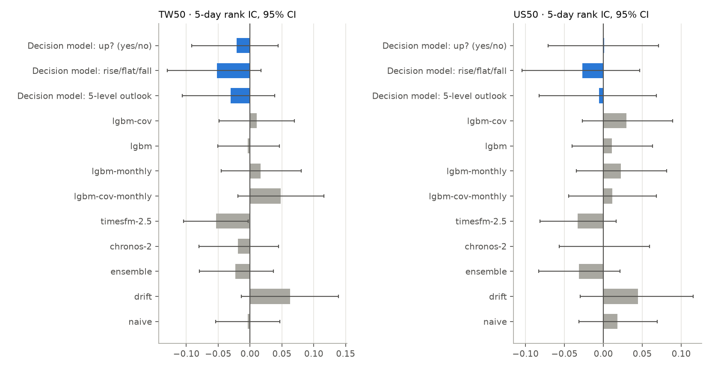
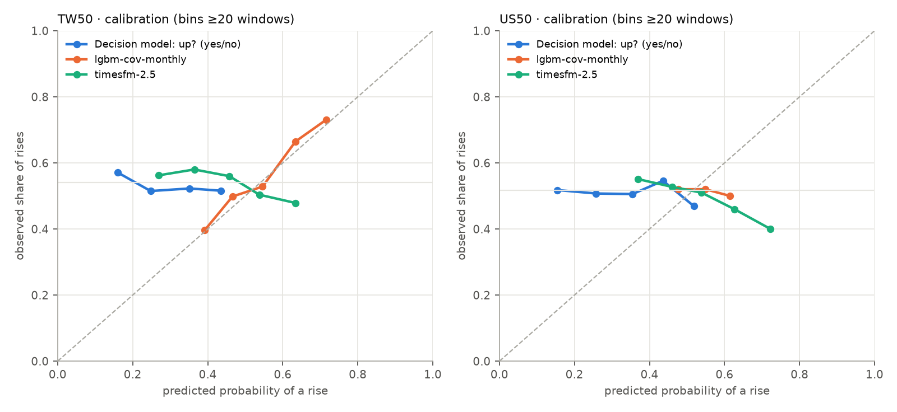
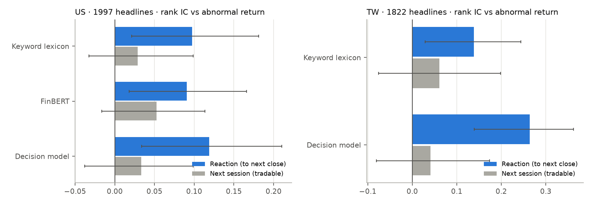

# 決策模型（Jev／Strands Decider）驗證：5 日漲跌與新聞判讀

> 測試日期 2026-10-02 · 硬體 M2 MacBook Pro（MPS）· 腳本 `scripts/decision_model_bench.py`、`scripts/plot_decision_bench.py`
>
> Jev（TypeSafe）需要 API 金鑰，這次先用開源、API 相同的 **Strands Decider 2B**（`StrandsAgents/strands-decider-2B-hobson-v19`，Apache-2.0，Qwen3.5-2B 底座）在本機跑完全部測試。設定 `TYPESAFE_API_KEY` 後，同一支腳本加 `--backend typesafe` 就會用 Jev 重跑，題目、資料、評分完全相同。

## 1. 結論

1. **5 日漲跌：決策模型沒有預測力，而且比擲硬幣還差。** 台股 50 檔、美股 50 檔、各約 2,400 個「股票×週」樣本，原始輸出的 Brier 分數 0.33（擲硬幣 0.25），AUC 0.48–0.50，每週排序 IC 約 0。即使用「只看過去資料」的方式重新校準，也只是回到擲硬幣的水準。
2. **原因：它只是在複述題目裡最顯眼的數字。** 它給的上漲機率和「過去 5 日報酬」的等級相關高達 0.88–0.89——漲多了就說會漲。這等於一條一行就能寫的動能規則，而這段期間短線反而是反轉。另外它的機率系統性偏低（平均 0.27，99% 的樣本 < 0.5），實際上漲比例是 52–54%。
3. **同一份資料，其他模型也幾乎都贏不了擲硬幣。** 台股最好的是每月重訓的 LightGBM（含籌碼）：Brier 0.2440、AUC 0.571、IC +0.048（t 1.38，未達顯著）；TimesFM 2.5、Chronos-2 都輸擲硬幣。美股沒有任何模型顯著勝過擲硬幣。這再次確認：至少在這 12 個月，大型股 5 日方向接近隨機，任何宣稱「高準確率漲跌預測」的產品都值得懷疑。
4. **選項順序會改變答案。** 把「漲／平／跌」的順序反過來，最可能的選項有 11–13% 會換掉。
5. **新聞判讀才是它的用武之地**：台股中文新聞，決策模型判斷「利多／利空」和當天超額報酬的排序相關 0.26（產品現行的關鍵字詞典 0.14），排除「標題本身就在報漲跌」的新聞後仍有 0.16（詞典 0.05，不顯著），而且 79% 的新聞判得出方向（詞典 22%）。美股英文新聞與 FinBERT、詞典差不多（0.12 對 0.09／0.10）。但**沒有任何方法能預測隔天的走勢**——新聞在一個交易日內就反映完了。
6. **速度與成本**：本機 M2 每次（3 題、約 550–600 token）中位數約 0.9–1.0 秒。換成 Jev，依官方價格（每百萬輸入 token US$0.042）每 1,000 次約 US$0.02–0.03。

**產品建議**：決策模型不要拿來產生「漲跌機率」——它既不準，在研究模式下也沒有必要。適合的用途是把文字變成結構化標籤：台股新聞的利多／利空與是否相關（取代關鍵字詞典，用在「為什麼動了」推播）、使用者問題的意圖分類、合規前置檢查。數值預測繼續交給 LightGBM 與成績單。

## 2. 為什麼這樣測

Jev 這類「System One」決策模型只回答三種題型：是非（noul，給機率）、單選（choice）、評分（score）。它不做算術、不懂日期，強項是把一段文字快速轉成校準過的機率。所以有兩個問題值得驗證：

- 把技術面、籌碼面整理成文字給它，它能不能判斷 5 日後漲跌？（第 3–5 節）
- 給它一則新聞標題，它能不能判斷對股價是利多還是利空？（第 6 節）

## 3. 方法：5 日漲跌

- **樣本與標籤**：完全沿用時間序列模型回測的視窗（`logs/b50_{tw50,us50}_h5.csv`），每 5 個交易日一個起點，台股 48 週（2025-10-01 → 2026-09-18）、美股 49 週（2025-10-06 → 2026-09-21），每週 50 檔。所有模型在同一批樣本、同一個標籤（5 日後收盤是否高於最新收盤）上評分。
- **輸入**：只用預測時點（前一日收盤）以前的資料，**匿名化**——不出現代號、公司名或日期，避免模型「回憶」後來發生的事。內容包括 1／5／20／60／250 日報酬、與 20／60／240 日均線距離、RSI、KD、MACD 柱狀體方向、量比、20 日波動、52 週區間位置、大盤 5／20 日報酬與 200 日線位置，台股另有外資與投信 5 日買賣超（以日均量為單位）、融資餘額變化。測試會檢查「改動預測點之後的價格，輸入文字完全不變」。
- **題目**（一次請求三題，英文）：
  - 是非題 `up`：5 個交易日後的收盤價是否高於最新收盤？
  - 單選題 `move`：漲超過 2%／±2% 以內／跌超過 2%（上漲機率取 P(漲) + ½P(平)）
  - 評分題 `outlook`：5 級（明顯偏空 → 明顯偏多）
- **評分**：Brier、log loss、AUC、準確率、ECE（校準誤差），以及每週橫斷面的排序 IC（Spearman）與前 20% 減後 20% 的報酬差。另外每個模型都做「逐週往前」的 Platt 校準（只用已經知道結果的過去週次擬合），看排除機率尺度問題後還剩多少資訊。信賴區間用以週為單位的 bootstrap。
- **對照組**：擲硬幣（0.5）、歷史上漲比例（逐週更新）、naive、drift、TimesFM 2.5／3.0（含共變數版本）、Chronos-2／Chronos-Bolt、LightGBM（一次訓練、每月重訓、含／不含籌碼共變數）、集成模型。

## 4. 結果：5 日漲跌

### 台股 50 檔（2,400 樣本，實際上漲比例 54.0%）

| 模型 | Brier ↓ | 對擲硬幣 BSS | 校準後 Brier | AUC | 準確率 | ECE | 每週 IC（t） |
|---|---|---|---|---|---|---|---|
| LightGBM＋籌碼（每月重訓） | **0.2440** | **+0.024** | 0.2466 | **0.571** | 54.6% | 0.023 | +0.048（1.38） |
| LightGBM＋籌碼 | 0.2461 | +0.015 | 0.2482 | 0.560 | 54.2% | 0.039 | +0.010（0.34） |
| LightGBM（每月重訓） | 0.2489 | +0.004 | 0.2506 | 0.509 | 53.2% | 0.008 | +0.016（0.50） |
| 擲硬幣 0.5 | 0.2500 | 0 | 0.2500 | 0.500 | 50.0% | 0.040 | – |
| naive | 0.2513 | −0.005 | 0.2505 | 0.499 | 48.8% | 0.048 | −0.004（−0.14） |
| drift | 0.2518 | −0.007 | 0.2507 | 0.522 | 52.9% | 0.047 | +0.063（1.63） |
| TimesFM 3.0 | 0.2597 | −0.039 | 0.2503 | 0.495 | 50.4% | 0.068 | −0.002（−0.06） |
| TimesFM 2.5 | 0.2630 | −0.052 | 0.2498 | 0.471 | 46.0% | 0.103 | −0.054（−2.04） |
| Chronos-2 | 0.2634 | −0.054 | 0.2495 | 0.475 | 47.8% | 0.090 | −0.019（−0.60） |
| 決策模型：5 級評分 | 0.2719 | −0.088 | 0.2502 | 0.467 | 47.3% | 0.132 | −0.031（−0.83） |
| 決策模型：漲／平／跌 | 0.3299 | −0.319 | 0.2499 | 0.455 | 47.0% | 0.251 | −0.052（−1.39） |
| 決策模型：是非題 | 0.3375 | −0.350 | 0.2507 | 0.475 | 46.1% | 0.269 | −0.021（−0.61） |

### 美股 50 檔（2,450 樣本，實際上漲比例 51.8%）

| 模型 | Brier ↓ | 對擲硬幣 BSS | 校準後 Brier | AUC | 準確率 | ECE | 每週 IC（t） |
|---|---|---|---|---|---|---|---|
| naive | **0.2497** | +0.001 | 0.2506 | 0.513 | 52.3% | 0.005 | +0.018（0.69） |
| 擲硬幣 0.5 | 0.2500 | 0 | 0.2504 | 0.500 | 50.0% | 0.018 | – |
| LightGBM＋籌碼（每月重訓） | 0.2516 | −0.006 | 0.2530 | **0.520** | 51.0% | 0.046 | +0.012（0.39） |
| drift | 0.2522 | −0.009 | 0.2510 | 0.520 | 51.8% | 0.042 | +0.044（1.17） |
| LightGBM | 0.2525 | −0.010 | 0.2508 | 0.502 | 51.3% | 0.042 | +0.011（0.41） |
| Chronos-2 | 0.2557 | −0.023 | 0.2507 | 0.505 | 49.2% | 0.065 | −0.000（−0.00） |
| TimesFM 2.5 | 0.2586 | −0.034 | 0.2501 | 0.476 | 48.4% | 0.071 | −0.033（−1.31） |
| TimesFM 3.0 | 0.2593 | −0.037 | 0.2507 | 0.494 | 49.4% | 0.080 | −0.003（−0.12） |
| 決策模型：5 級評分 | 0.2690 | −0.076 | 0.2516 | 0.495 | 49.6% | 0.116 | −0.006（−0.15） |
| 決策模型：漲／平／跌 | 0.3154 | −0.262 | 0.2514 | 0.489 | 49.9% | 0.221 | −0.027（−0.70） |
| 決策模型：是非題 | 0.3265 | −0.306 | 0.2513 | 0.500 | 48.2% | 0.254 | +0.001（0.03） |

（美股的「籌碼」指大盤、VIX、利率、美元指數等市場共變數。完整表格含 Chronos-Bolt、TimesFM XReg、集成等，見 `logs/dm_{tw50,us50}_h5_metrics.json`。）





## 5. 它到底在看什麼

決策模型的上漲機率與輸入特徵的等級相關（全部樣本）：

| 特徵 | 台股 | 美股 |
|---|---|---|
| 過去 5 日報酬 | **0.89** | **0.88** |
| KD 的 K 值 | 0.78 | 0.76 |
| RSI(14) | 0.75 | 0.72 |
| 與 20 日均線距離 | 0.74 | 0.74 |
| 過去 20 日報酬 | 0.55 | 0.55 |
| 外資 5 日買賣超 | 0.50 | – |
| 大盤 5 日報酬 | 0.29 | 0.30 |

每週橫斷面上，它的排序和「過去 5 日報酬」的排序相關 0.83–0.84。也就是說，它幾乎就是「最近漲的會繼續漲」這條規則；而這 12 個月大型股短線偏反轉（過去 5 日報酬的 IC：台股 −0.045、美股 −0.019），所以它的 IC 略為負。

其他觀察：
- **機率尺度不對**：是非題的平均上漲機率 0.27（台股）／0.27（美股），只有 0.2%／1.3% 的樣本 > 0.5；但實際上漲比例是 54%／52%。三種題型之間彼此一致（相關 0.90–0.92），問題不在題型，而在它對「會不會漲」沒有可靠的先驗。
- **選項順序敏感**：把單選題的選項順序反過來（每市場抽 300 筆），P(漲) 平均變動 0.06–0.07，最可能選項換掉的比例台股 13.3%、美股 11.3%。是非題的 true／false 說明順序對結果沒有影響。
- **與 LightGBM 合併沒有幫助**：把決策模型與 LightGBM＋籌碼的每週排名平均，台股 IC 從 0.010 變成 0.002，美股從 0.029 變成 0.017。

## 6. 新聞判讀

**方法**
- 標題：美股 50 檔取自 Yahoo Finance，1,997 則可計算反應（2026-07-30 → 10-01，多數在最近兩週）；台股 50 檔取自 FinMind，1,822 則（同一則新聞被多個網站轉載，去重後 1,208 則；2026-09-22 → 10-01）。每天執行會持續累積到 `logs/news_{us,tw}.jsonl`。
- 題目（這裡會給公司名稱與代號）：5 級評分「這則新聞對該公司下一個交易日股價的影響」（明顯利空 → 明顯利多），加上是非題「標題是否主要在講這家公司」。
- 標籤：發布前最後一個收盤 → 下一個收盤的**超額報酬**（個股減大盤），稱為「反應」；再下一個交易日的超額報酬稱為「延續」，這才是看到新聞後還來得及交易的部分。只使用已經收盤的交易日。
- 對照：產品現在用的關鍵字詞典（`features/sentiment.py`）、FinBERT（ProsusAI，僅英文）。
- 排序 IC（Spearman）＋以「股票×事件日」為單位的 cluster bootstrap 95% 信賴區間（美股 270 個、台股 187 個事件日）。

**結果：反應（發布 → 下一個收盤）**

| 評分方法 | 美股 IC | 給出方向的比例 | 台股 IC | 給出方向的比例 |
|---|---|---|---|---|
| 決策模型 | **0.119**（0.034–0.210） | 75% | **0.264**（0.139–0.362） | 79% |
| FinBERT | 0.091（0.018–0.166） | 64% | – | – |
| 關鍵字詞典（現行） | 0.097（0.021–0.181） | 17% | 0.138（0.029–0.244） | 22% |

決策模型判利多的新聞，台股平均超額報酬 +1.02%，判利空的 −1.02%；美股分別 +0.31%／−0.30%。

**去重、並排除「標題本身就在報漲跌」的新聞**（例如「盤中暴跌近 7%」「Stock Jumps 20%」，約占 16–17%，這類新聞和反應的關係是循環的）：

| 評分方法 | 美股（1,686 則） | 台股（1,001 則） |
|---|---|---|
| 決策模型 | 0.064（−0.009–0.133） | **0.157（0.062–0.241）** |
| FinBERT | 0.046（−0.018–0.111） | – |
| 關鍵字詞典 | 0.081（0.022–0.138） | 0.053（−0.038–0.140） |

**延續（下一個交易日，可交易的部分）**：所有方法都不顯著（美股 IC −0.016 ～ 0.053、台股 −0.017 ～ 0.062，信賴區間都跨 0）。



**解讀**
1. **台股中文新聞：決策模型明顯比現行的關鍵字詞典好**——排除報漲跌的標題後 IC 0.157 對 0.053，而且 79% 的新聞都判得出方向（詞典只有 22%，大部分新聞沒有命中關鍵字）。典型差異：「AI股狂瀉！聯發科失守5000元…『鴻海小金雞』訂單強勁」，詞典因「強勁」判利多，決策模型判利空（聯發科當天超額報酬 −6.3%）。
2. **美股英文新聞：三種方法差不多，訊號都弱**。去掉報漲跌的標題後只剩詞典還勉強顯著；決策模型與 FinBERT 的分數相關 0.68，看的東西很接近。
3. **沒有任何方法能預測隔天**。新聞情緒在發布後一個交易日內就反映完畢，適合拿來**解釋「為什麼動了」**，不適合當交易訊號——這和產品「事實歸因、不給建議」的定位剛好一致。
4. **「是否與該公司有關」有用但不完美**：AAPL 搜尋結果裡講 Microsoft 的文章被判為不相關（0.37–0.49）；但「Foghorn 因禮來終止合作而重挫」被當成禮來的重大利空。正式使用時相關性門檻要比 0.5 嚴格，或改用多選題問「主角是哪家公司」。

**測試過程順帶修好的兩個資料問題**（都會影響現有產品）
- Yahoo Finance 的個股新聞（`Ticker.news`）目前回傳空白，美股新聞面一直是空的 → 改用 Yahoo 搜尋並以相關代號過濾（`data/provider.py: yahoo_news_raw`）。
- FinMind `TaiwanStockNews` 一次只回傳 `start_date` 那一天、不接受日期區間；原本的寫法實際上只拿到「7 天前那一天」的新聞 → 改為從今天往回逐日抓，夠了就停（`data/finmind.py: news`）。

## 7. 速度與成本

| 項目 | 數值 |
|---|---|
| 本機 M2（MPS）每次請求，3 題 | 中位數 0.92–1.01 秒，p95 1.07–1.14 秒 |
| 本機 M2，新聞 2 題（標題較短） | 約 0.45 秒（每秒約 2.2 則） |
| 平均輸入 token（漲跌題） | 台股 605、美股 538 |
| 換成 Jev 的估計成本 | 每 1,000 次約 US$0.023–0.025（每百萬輸入 token US$0.042，輸出免費） |
| Jev 官方延遲 | 70–500 毫秒（美西），每秒 40 次請求上限 |

全市場（台股約 1,800 檔＋美股 500 檔）每天各問一次，Jev 約 US$0.06／天；本機 2B 模型約 40 分鐘。

## 8. 對產品的意義

- **不要用決策模型產生漲跌機率或「偏多／偏空」**：它沒有預測力，而且機率尺度錯誤；放進產品只會讓成績單變難看，也增加合規風險。
- **適合的位置是「文字 → 標籤」**：新聞分類（利多／利空／中性、是否與該公司有關、事件類型）、使用者問題意圖分類（查資料、問概念、要買賣建議 → 導向合規回覆）、合規檢查的第二道關卡、推播優先順序。這些都屬於事實整理，不是投資建議。
- **任何「預測」都要過成績單**：本次測試已經加入 `decision_model_bench.py`，將來換 Jev 或其他模型時，一行指令就能用同一批樣本重測。

## 9. 重現

```bash
# 1) 本機決策模型（另開一個虛擬環境，與主程式分開）
uv venv --python python3.11 ~/decider && uv pip install --python ~/decider/bin/python strands-decider
~/decider/bin/strands-decider serve StrandsAgents/strands-decider-2B-hobson-v19 --port 8100 --device mps

# 2) 5 日漲跌（約 40 分鐘／市場；結果會快取在 logs/systemone_cache.jsonl）
python scripts/decision_model_bench.py updown --universe tw50 --extra logs/lh_tw50_h5_ml.csv:monthly
python scripts/decision_model_bench.py updown --universe us50 --extra logs/lh_us50_h5_ml.csv:monthly

# 3) 新聞判讀（每天跑一次，標題會累積在 logs/news_{us,tw}.jsonl，樣本越來越大）
python scripts/decision_model_bench.py news --markets US TW

# 4) 圖表
python scripts/plot_decision_bench.py

# 換成 Jev
export TYPESAFE_API_KEY=...
python scripts/decision_model_bench.py updown --universe tw50 --backend typesafe --concurrency 8
```

## 10. 限制

- 這次測的是 2B 的開源模型，不是 Jev 本身。Jev 是商用模型，規模與訓練資料不同，但題型與 API 相同；第 5 節看到的「複述動能」與「選項順序敏感」是這類模型的共通風險，換成 Jev 時要重點檢查。
- 匿名化是為了避免模型記得歷史行情；代價是拿掉了公司名稱、產業、新聞等真實分析師會用的資訊。新聞部分（第 6 節）補上了這一塊。
- 12 個月、約 2,400 個樣本，每週 IC 平均值的標準誤約 0.03–0.04，小於 0.07 的差距都不顯著。
- 大型股、現有成分股（有存活者偏差），結果不代表中小型股。
- 新聞樣本集中在最近兩週、事件日不多（美股 270、台股 187 個「股票×事件日」），信賴區間很寬；每天執行累積一個月後再看一次。台股新聞是中文、題目是英文，模型仍能處理，但換成中文題目或 Jev 可能更好，值得再測。
